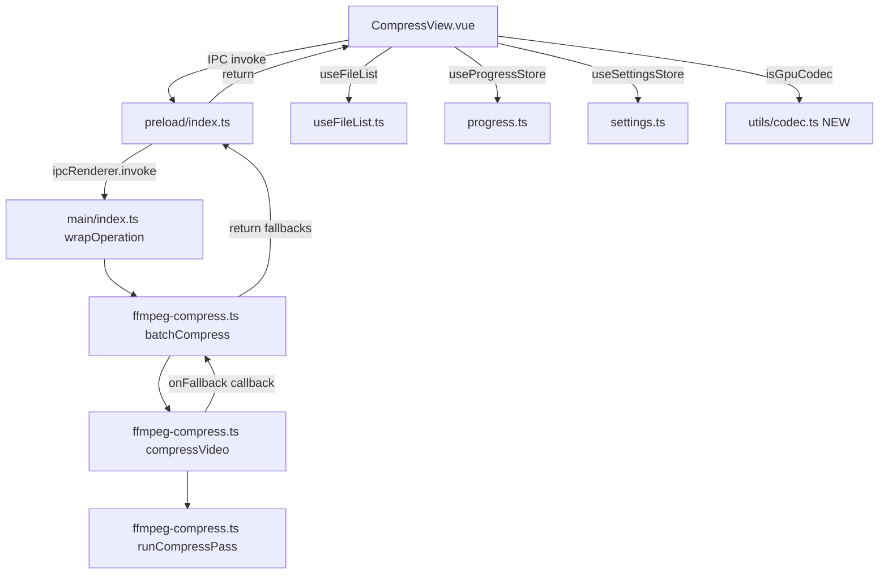

## 用户需求

对 `src/renderer/src/views/Compress/CompressView.vue` 进行全面代码审查，覆盖四个维度：编码问题、逻辑漏洞、冗余代码、内存泄露风险，并修复所有已识别的问题。

## 产品概述

本次为纯代码审查与修复任务，不涉及 UI 新建或重设计。审查范围以 CompressView.vue 为核心，延伸至其依赖链：useFileList.ts（文件列表管理）、progress.ts（进度状态）、ffmpeg-compress.ts（主进程压缩逻辑）、preload/index.ts + index.d.ts（IPC 类型桥接）、ffmpeg-shared.ts（共享工具）。

## 核心问题清单

### 编码问题

- 2-pass 日志文件泄露：`runCompressPass` 未设置 `cwd`，ffmpeg 默认将日志写入进程 CWD（应用根目录），而清理逻辑使用 `path.dirname(opts.output)`，两者不一致导致清理失效。工作区根目录已存在遗留文件 `ffmpeg2pass-0.log.mbtree` 作为证据。
- 空编码器列表未回退 GPU codec：`onMounted` 中 `encoders.length === 0` 时仅 warn，若持久化 codec 为 `h264_nvenc` 则压缩必失败。
- NVENC 驱动回退未同步 UI：主进程内部回退 libx264 后，渲染进程 codec ref 仍显示 NVENC。
- CRF=0 估值严重偏低：ratios 表仅含 {18,23,28,32}，CRF=0 命中默认 0.4 显示"40%"，实际输出常大于原文件。
- 分辨率→码率联动问题：'original' 分辨率清空用户已设码率；720p 默认 500k 偏低；360p 与 480p 同为 320k 不合理。

### 逻辑漏洞

- 取消后丢失部分成功结果：`startCompress` 中 `if (!progressStore.isProcessing) return` 导致已成功文件不标记 completed。
- 同名文件进度状态错配：用 basename 匹配，不同目录同名文件只标记第一个。
- meta 为 null 的成功文件被静默丢弃：不进入 compressResult 展示。
- 部分失败时进度仍显示"完成"（100%），与失败 errorMsg 并存造成困惑。

### 冗余

- `getStatusIcon` 是恒等函数，多一层无意义调用。
- `isGpuCodec` 判定逻辑在 CompressView 与 ffmpeg-compress.ts 中重复三处。

### 内存泄露风险

- `fileStatuses` 无 pruning：移除文件后旧 key 永久残留。
- `saveTimer` 未在 onUnmounted 清理：debounce 回调卸载后仍写 settingsStore。
- `fetchCommonPaths` 未做 isUnmounted 守卫：与下方 getAvailableEncoders 的守卫不一致。

## 技术栈

- 渲染进程：Vue 3.4 + TypeScript 5 + Pinia（Composition API + `<script setup>`）
- 主进程：Electron 31 + Node.js child_process（spawn ffmpeg）
- IPC 桥接：preload contextBridge + wrapOperation 统一注册模式
- 视频处理：ffmpeg-static（spawn 调用，非 fluent-ffmpeg）

## 实现方案

### 1. 2-pass 日志泄露修复（ffmpeg-compress.ts）

在 `compressVideo` 的 2-pass 分支中，使用 ffmpeg `-passlogfile` 参数指定日志文件绝对路径前缀（`path.join(path.dirname(opts.output), 'ffmpeg2pass')`），同时传入 pass1 和 pass2 的 args。清理时使用 `prefix + '-0.log'` 和 `prefix + '-0.log.mbtree'` 精确删除。同时删除工作区根目录遗留的 `ffmpeg2pass-0.log.mbtree`。

### 2. NVENC 回退反馈链（跨进程类型变更）

- `ffmpeg-compress.ts`：`CompressOptions` 新增可选 `onFallback?: (original: string, fallback: string) => void` 回调；`compressVideo` 在 NVENC 驱动回退时调用之；`batchCompress` 收集 fallbacks 并在返回值中增加 `fallbacks: { input: string; originalCodec: string; fallbackCodec: string }[]`。
- `preload/index.ts` + `preload/index.d.ts`：同步 `batchCompress` 返回类型。
- `CompressView.vue`：若 result.fallbacks 非空，显示提示"N 个文件因 GPU 驱动不兼容已自动回退 CPU 编码"。

### 3. 内存泄露修复（CompressView.vue + useFileList.ts）

- `onUnmounted`：增加 `if (saveTimer) { clearTimeout(saveTimer); saveTimer = null }`。
- `fetchCommonPaths` 回调内加 `if (isUnmounted) { return }` 守卫。
- CompressView 内包装 `handleRemoveFile(index)`：先 `delete fileStatuses.value[entry.path]`，再调用 `removeFile(index)`，模板改用包装函数。
- `startCompress` 开头：先清理 `fileStatuses` 中不存在于当前 files 的 key（pruning）。

### 4. 编码参数逻辑修复（CompressView.vue）

- `onMounted`：`encoders.length === 0` 时也回退 `codec.value = 'libx264'`。
- `RESOLUTION_BITRATE`：移除 'original' 的隐式清空行为（watch 中 'original' 时不清空 bitrate）；修正 720p→2000k、360p→200k。
- `estimateOutputSize`：CRF < 18 时返回 '≥原文件' 而非默认 0.4。

### 5. 批量压缩结果处理修复（CompressView.vue）

- 取消后仍处理 successFiles：移除 `if (!progressStore.isProcessing) return` 的过早返回，改为正常处理结果分支（用 `isUnmounted` 守卫即可）。
- 进度状态匹配改用 `info.currentFile`（1-based index）直接索引 `files.value[info.currentFile - 1]`，避免 basename 冲突。
- meta 为 null 时：用 `getFileInfo` 兜底获取 originalSize，仍展示到 compressResult。
- 部分失败时：`progressStore.finish()` 后设置 `errorMsg`，并在 ProgressPanel 旁显示"部分完成"提示（复用 errorMsg 已有的 alert-danger 展示）。

### 6. 冗余清理（CompressView.vue + 新建 utils/codec.ts）

- 删除 `getStatusIcon` 函数，模板内联 `fileStatuses[entry.path] || 'none'`。
- 新建 `src/renderer/src/utils/codec.ts` 导出 `isGpuCodec(codec: string): boolean`，CompressView 导入使用；`ffmpeg-shared.ts`（主进程）也导入同一逻辑（因跨进程无法共享模块，主进程侧提取为 `ffmpeg-shared.ts` 内的本地函数，注释标注与渲染层保持一致）。

## 实现备注

- **性能**：`estimateOutputSize` 在模板 `v-for` 中逐行调用，当前为 O(1) 算术运算，无需 memoize。
- **跨进程类型同步**：`batchCompress` 返回值新增 `fallbacks` 字段需同步修改 `preload/index.ts`（运行时实现）和 `preload/index.d.ts`（类型声明），两处缺一不可。
- **向后兼容**：`fallbacks` 为新增可选字段，现有 `compressVideo` 返回类型不变（仍为 `Promise<boolean>`），`onFallback` 为可选回调，不影响现有 `video:compress` handler。
- **blast radius**：所有修改集中在 Compress 功能模块及其依赖链，不影响 SplitMerge / Gif / Encrypt / Download 等其他功能。
- `ffmpeg-shared.ts` 中的 `isCancelled` 使用 `export let`（可变绑定），主进程侧的 `isGpuCodec` 提取为普通函数即可，不涉及可变绑定问题。

## 架构设计



## 目录结构

```
src/
├── main/modules/
│   ├── ffmpeg-compress.ts          # [MODIFY] 修复 2-pass 日志路径(-passlogfile)；新增 onFallback 回调；batchCompress 返回 fallbacks；提取 isGpuCodec 本地函数
│   └── ffmpeg-shared.ts            # [MODIFY] 新增 isGpuCodec 导出函数供主进程模块复用
├── preload/
│   ├── index.ts                    # [MODIFY] batchCompress 返回类型增加 fallbacks 字段
│   └── index.d.ts                  # [MODIFY] ElectronAPI.batchCompress 类型声明同步
├── renderer/src/
│   ├── views/Compress/
│   │   └── CompressView.vue        # [MODIFY] 修复全部逻辑漏洞/内存泄露/冗余；导入 isGpuCodec；包装 removeFile；修正编码参数逻辑
│   ├── composables/
│   │   └── useFileList.ts          # [无修改] removeFile 保持原签名，CompressView 侧包装清理
│   └── utils/
│       └── codec.ts                # [NEW] 导出 isGpuCodec(codec: string): boolean
```

## 关键代码结构

```typescript
// src/renderer/src/utils/codec.ts
export function isGpuCodec(codec: string): boolean {
  return codec.includes('nvenc') || codec.includes('qsv')
}

// src/main/modules/ffmpeg-shared.ts — 主进程侧同逻辑
export function isGpuCodec(codec: string): boolean {
  return codec.includes('nvenc') || codec.includes('qsv')
}

// batchCompress 返回值新增字段
interface BatchCompressResult {
  success: number
  successFiles: string[]
  failed: { input: string; error: string }[]
  fallbacks: { input: string; originalCodec: string; fallbackCodec: string }[]
}
```