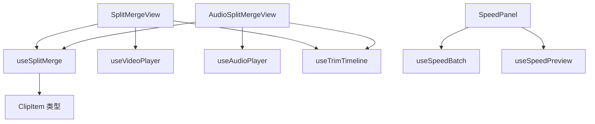

## 用户需求

审查并重构 `src/renderer/src/views/SplitMerge/` 目录下的 TypeScript / Vue / SCSS 代码：识别并合并冗余逻辑，评估性能优化空间，在不改变现有功能行为与视觉表现的前提下进行重构，并确保符合 AGENTS.md 编码规范。

## 产品概述

针对「视频分割/合并/变速」与「音频分割/合并」两个页面进行代码级重构，保持所有现有交互、错误提示、主题样式与页面布局完全不变，重点消除两视图间约 300 行重复逻辑，并修复编码规范违规项。

## 核心功能

- 抽取视频/音频两视图共享的片段列表增删、选中、排序、裁切、合并处理流程为可复用组合式函数，两视图以参数化差异接入
- 清理 SpeedPanel 内部重复的 watch、计算属性与速度选项常量定义
- 修复 AGENTS.md 规范违规：补齐 ClipList 文件头注释、删除 AudioSplitMergeView 重复的 time-input 样式、将硬编码 border-radius / 颜色 / 字体替换为设计 token
- 保持现有功能行为、IPC 调用、进度监听器生命周期与视觉样式不变

## 技术栈选择

- 完全复用现有技术栈：Vue 3.4（Composition API）+ TypeScript 严格模式 + Pinia + SCSS
- 不引入任何新依赖，遵循项目现有 composable 提取模式（参考 useTrimTimeline、useSpeedBatch 的模块级/实例级状态管理方式）
- 新增共享逻辑放在 `src/renderer/src/composables/`，符合「被 2 个以上组件共享 → 必须提取」规范

## 实现方案

### 核心策略

新建 `useSplitMerge.ts` 组合式函数，承载两视图完全同构的片段列表状态与操作逻辑。将视频/音频的差异点（扩展名、id 前缀、播放器引用、错误文案、裁切后回调）通过 options 参数注入，使两个视图从「复制粘贴 + 微调」变为「参数化复用」。视图仅保留各自独有的播放器、时间轴、元数据加载、变速、键盘快捷键、文件拖放等差异逻辑。

### 关键技术决策

1. **提取范围**：只提取真正同构且被两处复用的逻辑（片段 CRUD、selectedClipCount、canMerge、cleanupClipFiles、cutToClipList、getMergeOutputName、selectOutputPath、startProcess），避免过度抽象。元数据加载（getVideoMeta / getAudioMeta）因 trimEnd 默认值、错误文案、nextTick + load 等差异较大，保留在各视图内，仅复用其守卫思路。
2. **差异参数化**：options 提供 `outputExt`（视频固定 .mp4 / 音频源扩展名）、`clipIdPrefix`（clip_ / audio_clip_）、`mergeFallbackPrefix`（SN_ / SN_audio_）、`mediaNoun`（视频 / 音频）、`pausePlayer`、`seekTo`、`onAfterCut`（视频裁切后自动播放）。
3. **selectOutputPath 收编**：两视图的 selectOutputPath 仅在合并模式调用，split 分支属于不可达死代码。收编进 composable 后统一使用合并输出命名，删除视频视图的 `outputName`（重构后无引用）与 `getMergeOutputName`/`validateOutput` 本地实现。
4. **进度 store 复用**：composable 内部自行调用 `useProgressStore()`，与 useSpeedBatch 的既有模式一致，视图仍保留 store 引用用于模板绑定与卸载取消。

### 性能评估

- 无重大性能问题：播放器 onTimeUpdate 与各 computed 已合理缓存；selectedClipCount / canMerge 为 computed，无重复遍历。
- 重构主要收益是删除重复逻辑、减小打包体积；文件去重的 `includes`（O(n²)）在文件数极小的场景下无优化必要，保持不变。
- 不引入额外响应式开销：clips 仍为视图实例级 ref，每次调用 useSplitMerge 生成独立状态。

### 实现注意事项

- **爆炸半径控制**：不改动 `router/index.ts`、`config/features.ts`、`global.scss`、`_timeline.scss`、`utils/`、`types/file.ts`，确保两路由可正常访问且共享样式不受影响。
- **行为不变**：合并/裁切成功后的临时文件清理、失败时 store.reset、取消返回 false 等语义严格保持；统一 removeClip 的 console.warn 日志（音频原无日志，属无害补充）。
- **日志规范**：删除临时文件失败沿用 console.warn，不输出大对象、不泄露文件敏感路径。
- **规范合规**：新增文件必须带中文文件头注释；if 必须带花括号；所有函数声明返回类型；不执行 build（由用户自行验证）。
- **样式 token 化**：`border-radius: Npx` 统一替换为 `var(--radius-*)`，`font-family: monospace` 替换为 `var(--font-mono)`；rgba 渐变色可安全对齐主题变量的使用 `color-mix` 或主题变量，无法无损映射的保留原值并加中文注释说明。

## 架构设计



重构后职责划分：

- `useSplitMerge.ts`：片段列表状态与 CRUD、裁切、合并全流程
- 两个 View：文件/模式/播放器/时间轴/元数据/变速/键盘/拖放等差异逻辑
- `SpeedPanel.vue`：单段与批量变速的展示与交互

## 目录结构

```
src/renderer/src/
├── composables/
│   └── useSplitMerge.ts          # [NEW] 片段列表 CRUD 与裁切/合并流程，参数化复用两视图
└── views/SplitMerge/
    ├── SplitMergeView.vue        # [MODIFY] 接入 useSplitMerge，删除本地重复逻辑与死代码（outputName/getMergeOutputName/validateOutput），样式 token 规范化
    ├── AudioSplitMergeView.vue   # [MODIFY] 接入 useSplitMerge，删除重复 .time-input 与本地重复逻辑，样式 token 规范化
    ├── SpeedPanel.vue            # [MODIFY] 合并重复 watch 与 canAddSegment/canPreview，提取 SPEED_OPTIONS 常量
    └── ClipList.vue              # [MODIFY] 补充中文文件头注释
```

## 关键接口设计

`useSplitMerge(options)` 的 options 是视图差异的统一入口：

- `files`、`outputDir`、`errorMsg`：视图传入的源文件列表、输出目录、错误信息 ref，composable 直接读写
- `duration`、`trimStartSec`、`trimEndSec`、`trimDuration`：裁剪区间 ref，裁切后手柄推进依赖
- `pausePlayer`、`seekTo`：媒体暂停与跳转回调，屏蔽视频/音频玩家差异
- `outputExt`：返回输出扩展名的函数（视频 .mp4，音频源扩展名）
- `clipIdPrefix`：临时片段 id 前缀（clip_ 与 audio_clip_）
- `mergeFallbackPrefix`：无片段时合并输出名前缀（SN_ 与 SN_audio_）
- `onAfterCut`（可选）：裁切成功回调，视频用于自动播放预览
- `mediaNoun`：错误文案名词（视频 / 音频）

返回值：`clips`、`cuttingInProgress`、`selectedClipCount`、`canMerge` 状态，以及 `cutToClipList`、`removeClip`、`toggleClipSelection`、`moveClip`、`cleanupClipFiles`、`getMergeOutputName`、`selectOutputPath`、`startProcess` 操作函数。两视图解构使用，删除各自本地实现。

## 推荐使用的 Agent Extensions

### Skill

- **Frontend Components**
- 用途：在创建 `useSplitMerge.ts` 组合式函数时，指导单一职责划分、清晰的 options/返回值接口设计以及状态提升边界，确保组件与 composable 的接口契约清晰、可复用。
- 预期结果：产出职责单一、接口明确、符合项目 Vue 3 Composition API 模式的组合式函数，两个视图可无歧义接入。

- **lsp-code-analysis**
- 用途：重构两视图前，通过语义分析验证 `removeClip`、`toggleClipSelection`、`moveClip`、`getMergeOutputName`、`selectOutputPath`、`startProcess`、`outputName` 等符号的定义与引用，确认删除本地实现后无悬空引用。
- 预期结果：确认所有待删除符号的引用仅存在于当前文件内部，重构后 TypeScript 严格模式编译通过、无残留调用。