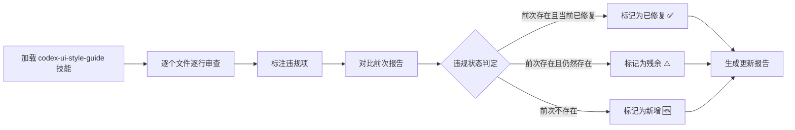

## 审查目标

使用 codex-ui-style-guide 技能对 snVideoEditor 项目所有样式相关文件进行全面审查，生成最新的样式规范化审查报告。

## 审查范围

覆盖项目中所有 13 个样式相关文件，包括 1 个全局 SCSS、1 个 Tailwind 配置文件、10 个含 style 块的 Vue 组件、1 个纯 Tailwind 类的 Vue 页面。

## 审查内容

1. **逐文件逐行审查**：对每个文件的每个 `<style>` 块和 `@layer components` 类按 6 条核心规则（硬编码色值/box-shadow滥用/transition时长/硬编码px间距/硬编码圆角/硬编码字号）进行检查
2. **新旧对比**：与 2026-06-26 前次报告（80 处违规：P0:14/P1:59/P2:7）逐项对比，标注已修复项、仍存在的残余违规项，以及代码变更引入的新增违规项
3. **新增文件首次审查**：GifConvertView.vue、DownloadQueue.vue、PlayerView.vue、HomeView.vue 在前次报告中未覆盖，本次需完整审查
4. **生成更新报告**：输出至 `docs/codex-style-review-report.md`，包含审查概览、逐文件详细清单、统计汇总、P0 修复方案、Tailwind 迁移建议

## 审查标准（Tailwind 项目适配版）

- **Rule 4 硬编码色值**：禁止裸 hex/RGBA，必须使用 CSS 变量或 Tailwind token
- **Rule 8 border > box-shadow**：视觉分层用 border（focus 环和装饰性动画除外）
- **Rule 9 transition 0.12s**：交互过渡统一 0.12s，页面级动画可 0.2s-0.3s
- **Rule 1-3**：硬编码 px spacing/border-radius/font-size 尽量用 CSS 变量替代
- Vue template 中使用的 Tailwind 工具类（如 `bg-bg-primary`、`text-text-primary`）视为合规

## 审查架构

本次为纯审查任务，不涉及代码修改。审查流程如下：

### 审查流程

### 文件分组

| 组别 | 文件 | 审查策略 |
| --- | --- | --- |
| 全局样式 | global.scss | 重点审查 @layer components 中的工具类 |
| 配置文件 | tailwind.config.js | 检查 darkMode、自定义 token 合规性 |
| 已审查文件(8个) | App/SideNav/TitleBar/ProgressPanel/SplitMerge/Compress/Encrypt/Player | 对比前次报告，标注修复/残余 |
| 新增文件(3个) | GifConvert/DownloadQueue/HomeView | 首次完整逐行审查 |
| 无 style 块(2个) | HomeView/ClipList | 仅审查 Tailwind 类使用情况 |

### 审查工具

- 使用 **codex-ui-style-guide** 技能中定义的 6 条严格规则（Rule 1/2/3/4/8/9）作为审查基准
- 使用前次报告（docs/codex-style-review-report.md）作为对照基线
- 参考项目 CODEBUDDY.md 中的设计风格说明理解项目配色体系

### 输出产物

更新 `docs/codex-style-review-report.md`，保留前次报告历史章节，新增本次审查结论。

## Agent Extensions

### Skill

- **codex-ui-style-guide**
- Purpose: 提供 Codex UI 样式规范（17 条规则），作为审查基准。审查过程中对照每条规则逐一检查每个文件的 style 块。
- Expected outcome: 每条违规判定均能引用具体规则编号（Rule 1/2/3/4/8/9），确保审查结果有据可依。

### SubAgent

- **code-explorer**
- Purpose: 确认项目中是否存在未被覆盖的样式文件（如 .css 文件、未在清单中的含 style 块的 Vue 文件）。
- Expected outcome: 确认审查范围完整无遗漏，所有样式文件均已纳入审查。