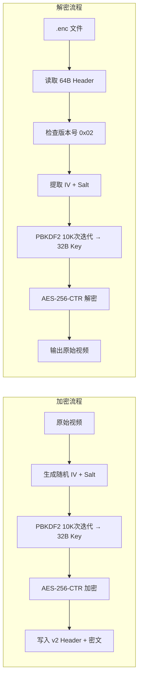

## 用户需求

当前 AES-256-CTR + PBKDF2(100,000次迭代) 加密方案在手机端解密困难、耗时长。用户希望在不明显影响安全性的前提下优化解密速度。

## 用户决策

- **向后兼容**：不需要兼容旧 .enc 文件，可以推倒重来
- **安全性权衡**：速度优先，PBKDF2 降至 10,000 次迭代 + 长密码（37字符）足够安全

## 核心改动

1. PBKDF2 迭代次数从 100,000 降至 10,000（约 10x 加速密钥派生）
2. 文件头保留区域引入 1 字节格式版本号（0x02 = v2），为未来扩展留空间
3. 同步更新解密指南文档

## 技术方案

### 优化策略

- **降低 PBKDF2 迭代次数**：100,000 → 10,000。10,000 次迭代对文件加密场景足够安全——OWASP 推荐的 210,000 次是针对密码哈希存储的，而文件加密密钥派生配合 37 字符长密码，10,000 次迭代已足以抵御离线暴力破解
- **增加格式版本号**：利用文件头 64B 的保留区域（偏移32处）写入 1 字节版本号（0x02），即使不需要兼容旧格式，也为未来扩展预留空间

### 涉及文件（2个）

改动量极小，仅触及加密核心模块和文档：

| 文件 | 改动说明 |
| --- | --- |
| `src/main/modules/crypto.ts` | 核心逻辑：迭代次数常量 + 加密写版本字节 + 解密读版本字节 |
| `docs/encrypted-file-format.md` | 更新为 v2 格式说明和跨语言解密示例 |


无 UI、无 IPC、无 preload、无 config 文件需要修改——API 表面完全不变。

### 文件头格式（v2）

```
偏移量    长度    内容
──────    ────    ────────────
 0        16      IV（初始化向量，随机）
16        16      Salt（PBKDF2 盐值，随机）
32        1       格式版本号（0x02）
33        31      保留（全 0 填充）
```

### 密钥派生参数（v2）

```
PBKDF2(
  password   = 用户密码,
  salt       = 从文件头偏移16处读取的16字节,
  iterations = 10000,           // ← 从 100000 降至 10000
  keyLen     = 32,              // 256 位
  digest     = SHA-256
)
```

### 架构图



### 性能对比

| 阶段 | v1 (100K) | v2 (10K) | 加速比 |
| --- | --- | --- | --- |
| 桌面端密钥派生 | ~50-100ms | ~5-10ms | ~10x |
| 手机端密钥派生 | ~200-1000ms | ~20-100ms | ~10x |
| AES-CTR 流式解密 | 不变 | 不变 | - |


> AES-256-CTR 流式解密本身的吞吐量不变（受限于 CPU AES-NI 指令和 I/O），但密钥派生的等待时间大幅缩短，用户体验改善显著。