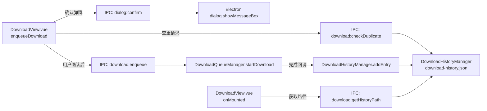

## 产品概述

为视频下载功能增加下载历史持久化能力：每次下载完成后将记录写入独立 JSON 文件，下次下载前自动检查文件名是否重复并弹窗提示，同时在下载页 UI 上展示历史 JSON 文件路径。

## 核心功能

- **下载完成持久化**：下载成功后，将该次下载记录（文件名、URL、输出路径、完成时间、文件大小）追加写入 `download-history.json`
- **下载前去重检查**：用户点击下载时，检查当前文件名是否已存在于历史记录中；若存在，弹窗提示"该文件名已下载过，是否重复下载"，用户确认后方可继续
- **JSON 路径展示**：在下载页"输出设置"区域底部显示历史 JSON 文件的完整路径，并附带"打开所在文件夹"按钮

## 技术栈

基于现有项目技术栈（Electron 31 + Vue 3 + TypeScript + Pinia），不引入新依赖。

## 实现方案

### 整体策略

新建独立模块 `src/main/modules/download-history.ts`，实现 `DownloadHistoryManager` 单例（与 `DownloadQueueManager` 模式一致），管理 `download-history.json` 的读写。在 `DownloadQueueManager.startDownload()` 的 `.then()` 完成回调中触发历史记录写入。新增 IPC handler 暴露查重、获取路径、清空历史等能力。渲染进程在 `enqueueDownload()` 前调用查重接口，命中时通过原生 dialog 弹窗确认。

### 关键技术决策

1. **独立 JSON 文件**：`download-history.json` 存放于 `app.getPath('userData')`，与现有 `download-queue.json`（队列恢复用）职责分离，互不干扰。
2. **查重按 fileName 匹配**（Windows 不区分大小写），符合用户"文件名一致"的表述。
3. **原生弹窗确认**：新增 `dialog:confirm` IPC handler，使用 Electron `dialog.showMessageBox`，可靠且无需自建模态组件，符合项目"无第三方 UI 组件库"的现状。
4. **写盘策略**：每次下载完成追加一条记录后立即同步写盘（频率低，无需防抖），JSON 文件结构为 `{ entries: HistoryEntry[] }`。
5. **文件大小获取**：下载完成后复用 `fs.statSync(item.output)` 获取实际文件大小，失败则省略该字段。

### 实现要点

- `download-history.ts` 需 `import { app } from 'electron'`，`getFilePath()` 返回 `path.join(app.getPath('userData'), 'download-history.json')`，与 `download-queue.ts` 的 `getQueueFilePath()` 模式完全一致。
- `DownloadQueueManager.startDownload()` 的 `.then()` 回调（约 440-451 行）在 `item.status = 'completed'` 后调用 `DownloadHistoryManager.getInstance().addEntry(...)`，避免影响现有清理缓存逻辑。
- `DownloadView.vue` 的 `enqueueDownload()`（343-379 行）在 `isEnqueueing` 保护之后、`window.electronAPI.enqueueDownload` 之前插入查重逻辑；查重命中时调用 `await window.electronAPI.confirmDialog(...)`，返回 false 则提前 return。
- 路径展示复用已有 `openFolder` API（preload 第 33 行）实现"打开所在文件夹"。
- IPC handler 注册放在 `registerDownloadHandlers()`（index.ts 272-365 行）内，与其他 download handler 同区。
- preload `index.ts` 与 `index.d.ts` 两处必须同步新增方法声明，保持类型安全单一数据源原则。

### 性能说明

- 历史记录写入仅在下载完成时触发（低频），单次 `JSON.stringify + writeFileSync` 开销可忽略。
- 查重为 `Array.find` 线性扫描，历史记录量级为百条以内，无性能瓶颈。
- 读路径在 `onMounted` 时一次性获取，无重复请求。

## 架构设计



## 目录结构

```
src/
├── main/
│   ├── modules/
│   │   └── download-history.ts     # [NEW] 下载历史管理单例。定义 HistoryEntry 接口（fileName/url/output/completedAt/fileSize?），实现 addEntry/checkDuplicate/getFilePath/getAll/clear 方法，JSON 读写复用 fs 同步 API，模式对齐 download-queue.ts 的持久化实现。
│   ├── modules/
│   │   └── download-queue.ts       # [MODIFY] 在 startDownload().then() 完成回调中（约 440-451 行 item.status='completed' 之后）调用 DownloadHistoryManager.getInstance().addEntry() 写入历史记录。import 新模块。
│   └── index.ts                    # [MODIFY] registerDownloadHandlers() 内新增 4 个 IPC handler：download:checkDuplicate、download:getHistoryPath、download:getHistory、download:clearHistory；新增 dialog:confirm handler（可用 BrowserWindow.getFocusedWindow 调用 dialog.showMessageBox）。
├── preload/
│   ├── index.ts                    # [MODIFY] electronAPI 对象新增 5 个方法：checkDownloadDuplicate(fileName)、getDownloadHistoryPath()、getDownloadHistory()、clearDownloadHistory()、confirmDialog(message, title?)，通过 ipcRenderer.invoke 桥接。
│   └── index.d.ts                  # [MODIFY] ElectronAPI 接口同步新增上述 5 个方法的类型声明，并导出 HistoryEntry 接口供渲染进程引用。
└── renderer/src/
    └── views/Download/
        └── DownloadView.vue        # [MODIFY] onMounted 中获取历史 JSON 路径存入 ref；enqueueDownload() 中 enqueue 前插入查重 + confirmDialog 逻辑；模板"输出设置"卡片底部新增历史 JSON 路径展示行（含"打开所在文件夹"按钮，复用 openFolder）。
```

## 关键代码结构

```ts
// src/main/modules/download-history.ts
export interface HistoryEntry {
  fileName: string
  url: string
  output: string
  completedAt: number
  fileSize?: number
}

export class DownloadHistoryManager {
  static getInstance(): DownloadHistoryManager
  getFilePath(): string
  addEntry(entry: HistoryEntry): void
  checkDuplicate(fileName: string): HistoryEntry | null
  getAll(): HistoryEntry[]
  clear(): void
}
```

```ts
// preload/index.ts — 新增方法签名
checkDownloadDuplicate: (fileName: string) => Promise<HistoryEntry | null>
getDownloadHistoryPath: () => Promise<string>
getDownloadHistory: () => Promise<HistoryEntry[]>
clearDownloadHistory: () => Promise<void>
confirmDialog: (message: string, title?: string) => Promise<boolean>
```