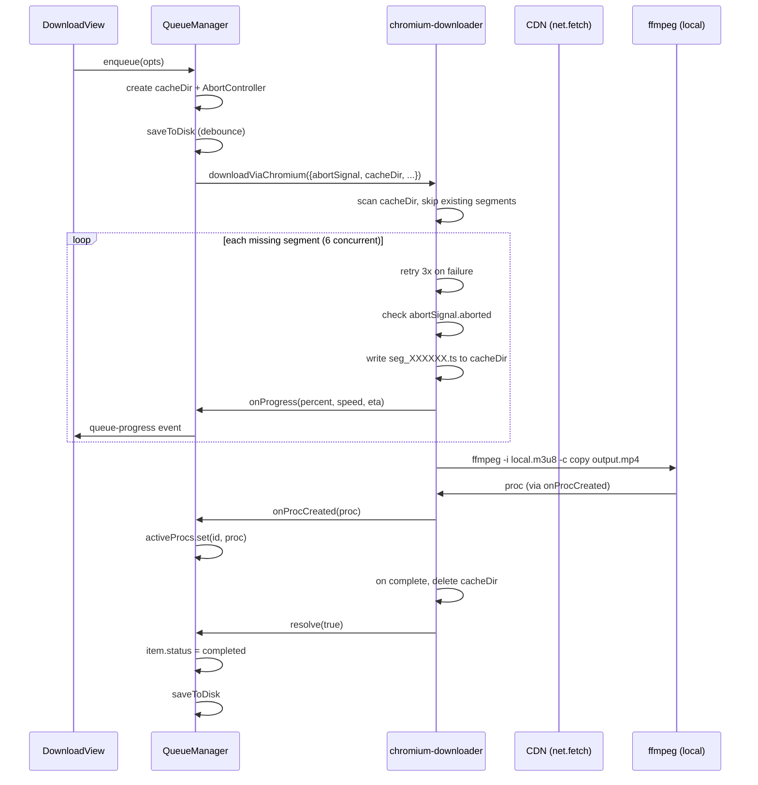
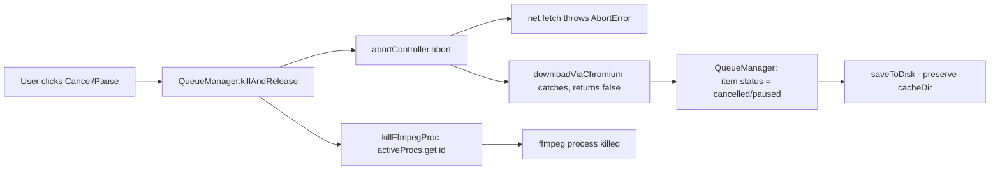

## 用户需求

将代码审查发现的下载流程问题（#1-10）与队列持久化/断点续传功能合并为一个综合修复计划。

## 产品概述

修复当前下载模块中存在的严重 Bug（暂停恢复失效、取消误杀并发任务、ETA 错误等），并新增队列持久化和断点续传能力，使重启程序后可恢复未完成的下载任务。

## 核心功能

- **Per-item 取消**：每个下载任务独立取消/暂停，不再误杀其他并发任务
- **断点续传**：暂停或重启后，跳过已下载的 TS 分片，只下载缺失部分
- **队列持久化**：程序重启后恢复队列状态（pending/paused/failed 保留，downloading 转 pending）
- **单分片重试**：网络波动导致单个 TS 下载失败时自动重试 3 次
- **真实分片时长**：从 m3u8 解析实际 `#EXTINF` 时长，不再硬编码 10 秒
- **ETA 修正**：用累计下载量计算平均分片大小，修正剩余时间估算
- **变体检测走 Chromium**：`fetchM3u8Variants` 改用 `net.fetch`，Cloudflare 站点不再 403
- **代码清理**：删除死代码 `useHeaders.ts`，统一 UA 常量，移除未使用导入

## Tech Stack

- Electron 31 主进程（`net.fetch` / `app.getPath` / `BrowserWindow`）
- Node.js `fs` / `path` / `child_process`
- TypeScript 严格模式
- 现有 IPC 架构（`wrapOperation` + 队列回调）

## Implementation Approach

### 1. Per-item 取消架构（核心改动）

**问题**：`ffmpeg-shared.ts:150` 的 `isCancelled` 和 `currentProc` 是全局单例，并发下载时取消任务 A 会误杀 B/C/D。

**方案**：下载流程完全脱离全局 `isCancelled`/`setFfmpegProc`，改用 per-item `AbortSignal`：

```
download-queue.ts                     chromium-downloader.ts
┌─────────────────┐                  ┌──────────────────────┐
│ per-item        │                  │                      │
│ AbortController │──signal─────────▶│ net.fetch(signal)    │
│                 │                  │ abortSignal.aborted? │
│ activeProcs Map │──onProcCreated──▶│ ffmpeg proc          │
│ (kill directly) │◀──proc──────────│                      │
└─────────────────┘                  └──────────────────────┘
```

- `ChromiumDownloadOptions` 新增 `abortSignal?: AbortSignal`
- `downloadViaChromium` 删除所有 `isCancelled` 检查，改查 `opts.abortSignal?.aborted`
- `chromiumFetch` 已支持 `signal` 参数，只需透传 `opts.abortSignal`
- `convertLocalM3u8` 不再调用 `setFfmpegProc`，仅通过 `onProcCreated` 回调让队列自行管理
- `download-queue.ts` 的 `killAndRelease` 直接 kill `activeProcs.get(id)` + `abortController.abort()`
- 队列为每个 item 维护 `private activeAbortControllers = new Map<string, AbortController>()`

### 2. 断点续传

**问题**：TS 分片存在 `os.tmpdir()` 临时目录，暂停/取消后清理，恢复=重新下载。

**方案**：

- `ChromiumDownloadOptions` 新增 `cacheDir?: string`
- 若提供 `cacheDir`，用它替代 `os.tmpdir()`
- `downloadViaChromium` Phase 2 开始前扫描 `cacheDir` 下已存在的 `seg_*.ts` 文件，跳过已下载的分片
- 暂停/取消时**不删除** `cacheDir`
- 下载完成（成功）后删除 `cacheDir`
- `QueueItem` 新增 `cacheDir?: string` 字段，持久化到 JSON

### 3. 队列持久化

**方案**：

- 存储路径：`app.getPath('userData')/download-queue.json`
- `DownloadQueueManager` 新增 `private saveToDisk()` 和 `loadFromDisk()` 方法
- `notifyStatus()` 内 debounce 1s 触发 `saveToDisk()`（避免高频写盘）
- `saveToDisk` 序列化 `items` 数组（含 `cacheDir`、`headers`、`progress` 等全部字段）
- `loadFromDisk` 在 `app.whenReady` 后调用，将 `downloading` 状态转为 `pending`，其他状态保持
- `main/index.ts` 的 `window-all-closed` 事件中同步调用 `saveToDisk()` 再 `app.quit()`
- `app.getPath('userData')` 需通过 `app` 导入（`main/index.ts` 已有 `app` 导入）

### 4. 单分片重试

- `downloadSegment` 包裹 retry 循环：最多 3 次，每次间隔 `1000 * attempt` ms
- 重试前检查 `abortSignal.aborted`，已取消则不再重试

### 5. 真实 #EXTINF 时长

- `parseTsUrls` 返回类型从 `string[]` 改为 `{ url: string; duration: number }[]`
- 解析 `#EXTINF:10.000,` 提取浮点时长，默认 10.0
- 构建本地 m3u8 时使用实际时长：`#EXTINF:${seg.duration},`

### 6. ETA 修正

- 新增 `totalDownloadedBytes`（累计，不重置）和 `totalElapsedMs`
- ETA = `(remainingSegments * avgSegmentBytes) / avgBytesPerSec`
- `avgSegmentBytes = totalDownloadedBytes / completed`
- `avgBytesPerSec = totalDownloadedBytes / (totalElapsedMs / 1000)`

### 7. fetchM3u8Variants 走 Chromium

- `download.ts` 导入 `net` from `electron`
- `fetchM3u8Variants` 内部用 `net.fetch(url, { headers })` 替代 `httpGetText`
- 保留 `httpGetText` 函数（可能其他地方有引用，但实际检查后如无引用则删除）

### 8. 代码清理

- 删除 `src/renderer/src/composables/useHeaders.ts`
- `chromium-downloader.ts` 删除 `CHROME_UA` 常量，改为从 `download.ts` 导入 `DEFAULT_UA`
- `chromium-downloader.ts` 移除未使用的 `isCancelled`、`resetCancelled`、`cancelFfmpegOperation`、`setFfmpegProc` 导入
- `chromium-downloader.ts` 的 `convertLocalM3u8` 移除 `setFfmpegProc(proc)` 调用

## Implementation Notes

- **性能**：`saveToDisk` debounce 1s 避免每次进度更新都写盘；TS 分片扫描用 `fs.existsSync` 只在下载开始时执行一次
- **向后兼容**：`abortSignal` 和 `cacheDir` 均为可选字段，不影响现有 `video:download` 单次下载通道
- **全局 isCancelled 保留**：`ffmpeg-shared.ts` 的全局取消机制仍供 split/compress/gif/crypto 等非队列操作使用，仅下载队列脱离此机制
- **临时文件清理**：`window-all-closed` 时同步保存队列后退出；`download-cache` 目录中已完成任务的缓存由下载成功时清理，未完成任务的缓存保留供恢复

## Architecture Design

### 修改后的下载流程



### Per-item 取消流程



## Directory Structure

```
src/
├── main/
│   ├── modules/
│   │   ├── chromium-downloader.ts    # [MODIFY] 移除全局 isCancelled/setFfmpegProc 依赖，新增 abortSignal/cacheDir 支持；单分片重试；真实 #EXTINF；ETA 修正
│   │   ├── download-queue.ts         # [MODIFY] per-item AbortController + activeAbortControllers Map；QueueItem 新增 cacheDir；saveToDisk/loadFromDisk 持久化
│   │   ├── download.ts               # [MODIFY] DownloadOptions 新增 abortSignal；fetchM3u8Variants 改用 net.fetch；移除 httpGetText（如无其他引用）
│   │   └── ffmpeg-shared.ts          # [NO CHANGE] 全局 isCancelled/setFfmpegProc 保留供非下载操作使用
│   └── index.ts                      # [MODIFY] app.whenReady 后调用 queueManager.loadFromDisk()；window-all-closed 时调用 saveToDisk()
├── renderer/
│   └── composables/
│       └── useHeaders.ts             # [DELETE] 死代码，DownloadView 不再引用
└── preload/
    ├── index.ts                      # [MODIFY] getQueueStatus 返回类型增加 cacheDir 字段（可选）
    └── index.d.ts                    # [MODIFY] 同步增加 cacheDir 类型声明
```

## Key Code Structures

### ChromiumDownloadOptions（修改后）

```typescript
export interface ChromiumDownloadOptions {
  url: string
  output: string
  headers?: Record<string, string>
  /** Per-item abort signal for cancellation. Replaces global isCancelled. */
  abortSignal?: AbortSignal
  /** Persistent cache directory for TS segments (enables resume). If omitted, uses os.tmpdir(). */
  cacheDir?: string
  onProgress?: (data: { percent: number; speed: string; eta: string }) => void
  onProcCreated?: (proc: ChildProcess) => void
  onDurationDetected?: (durationSec: number) => void
}
```

### DownloadOptions（修改后）

```typescript
export interface DownloadOptions {
  url: string
  output: string
  headers?: Record<string, string>
  startTime?: number
  /** Per-item abort signal, forwarded to downloadViaChromium. */
  abortSignal?: AbortSignal
  /** Persistent cache dir for resume support. */
  cacheDir?: string
  onProgress?: (data: { percent: number; currentFile: number; totalFiles: number; speed: string; eta: string }) => void
  onProcCreated?: (proc: import('child_process').ChildProcess) => void
  onDurationDetected?: (durationSec: number) => void
}
```

### QueueItem（修改后，新增 cacheDir）

```typescript
export interface QueueItem {
  id: string
  url: string
  output: string
  headers?: Record<string, string>
  cacheDir?: string  // [NEW] persistent path for TS segments
  status: 'pending' | 'downloading' | 'completed' | 'failed' | 'cancelled' | 'paused'
  progress: { percent: number; speed: string; eta: string }
  error?: string
  addedAt: number
  fileName: string
  pausedAtPercent?: number
  cachedDurationSec?: number
}
```

## Agent Extensions

### SubAgent

- **code-explorer**
- Purpose: 在实施前快速验证 `httpGetText` 是否有除 `fetchM3u8Variants` 外的其他调用方，确认是否可安全删除
- Expected outcome: 确认 `httpGetText` 的全部引用点，决定保留或删除