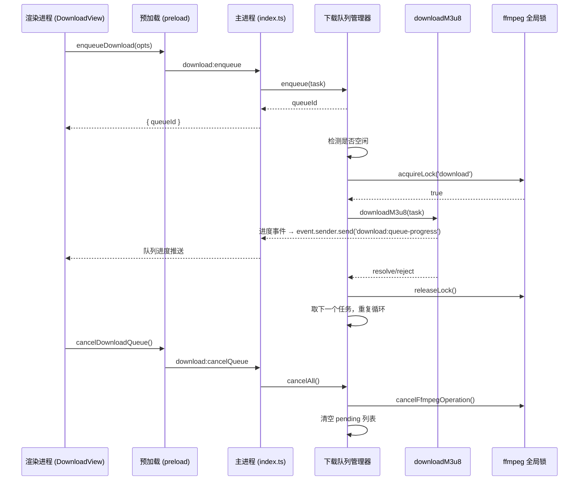

## 用户需求

下载进行中时，用户可以继续输入新的 URL / 网页地址、选择输出路径、配置 Headers，将新任务加入下载队列。当前下载完成后自动开始下载下一个。队列中每个任务独立显示状态和进度。

## 核心功能

- **加入队列**：下载进行中时，"开始下载"按钮变为"加入队列"，点击后将当前配置的快照加入队列
- **队列自动消费**：主进程串行执行队列中的下载任务，一个完成后自动开始下一个，不为空则持续运行
- **队列列表展示**：右侧面板显示所有队列项，每项展示序号、URL 摘要、状态标签（等待中/下载中/已完成/失败）、进度条、操作按钮
- **取消与移除**：支持取消当前正在下载的任务并自动跳到下一个；支持移除队列中等待中的任务
- **失败重试**：下载失败的任务显示错误信息，提供重试按钮将其移回待处理列表
- **清空队列**：一键取消当前下载并清空所有待处理任务
- **"从网页提取"解锁**：下载进行中时不再禁用，用户可并行提取下一个视频的 m3u8 地址

## 技术方案

### 实现思路

采用"主进程队列管理器 + 渲染进程队列视图"的架构。队列管理器作为 singleton 驻留在主进程，持有任务列表并串行消费。每一个下载项执行时通过内部 acquireLock/releaseLock 与现有的全局操作锁互斥，确保下载与压缩/分割等其他 ffmpeg 操作不会同时运行（因为共享 `currentProc`）。

### 架构设计



### 关键设计决策

1. **队列管理器独立于 `wrapOperation`**：原有 `video:download` 走 `wrapOperation` 加锁一次，队列模式下改为队列管理器内部逐个加锁/解锁。网页提取（`fetchPageM3u8`）和清晰度解析（`fetchM3u8Variants`）不涉及 ffmpeg，无需排队。

2. **单 ffmpeg 进程安全**：`currentProc` 是全局单例，队列管理器每次开始下载前 acquireLock，完成后 releaseLock，确保与其他 ffmpeg 操作（压缩、分割等）互斥。

3. **进度按 queueId 区分**：进度事件新增 `queueId` 字段，前端根据 `queueId` 更新对应队列项进度，ProgressPanel 显示当前执行中任务的进度。

4. **任务快照**：加入队列时捕获当时的 URL、输出路径、Headers 等完整配置（深拷贝），后续修改输入框不影响已入队的任务。

### 目录结构

```
src/
├── main/
│   ├── index.ts                      # [MODIFY] 新增 download:enqueue / cancelQueue / removeQueueItem / retryQueueItem 四个 IPC handler；移除原 video:download 的 wrapOperation 包装
│   └── modules/
│       ├── download.ts               # [MODIFY] 导出 DownloadOptions 接口，downloadM3u8 保持不变
│       └── download-queue.ts         # [NEW] 下载队列管理器核心模块
├── preload/
│   ├── index.ts                      # [MODIFY] 新增 enqueueDownload / cancelDownloadQueue / removeQueueItem / retryQueueItem / getQueueStatus 五个 API
│   └── index.d.ts                    # [MODIFY] 对应类型声明
└── renderer/src/
    ├── stores/
    │   └── progress.ts               # [MODIFY] 新增 queueItems 状态、download-error / download-cancelled 等操作类型
    ├── views/
    │   └── Download/
    │       ├── DownloadView.vue       # [MODIFY] 按钮逻辑改为 "加入队列" / "取消全部"，解除"从网页提取"按钮的下载中禁用限制，集成 DownloadQueue 组件
    │       └── DownloadQueue.vue      # [NEW] 队列列表组件，显示所有队列项的序号、URL摘要、状态标签、进度条、操作按钮
    └── components/
        └── ProgressPanel.vue         # [MODIFY] 增加下载队列模式的标签和提示文字
```

### 核心代码结构

**`src/main/modules/download-queue.ts` 关键接口：**

```ts
export interface QueueItem {
  id: string
  url: string
  output: string
  headers?: Record<string, string>
  status: 'pending' | 'downloading' | 'completed' | 'failed' | 'cancelled'
  progress: { percent: number; speed: string; eta: string }
  error?: string
  addedAt: number
}

export interface QueueStatus {
  items: QueueItem[]
  isProcessing: boolean
}

export class DownloadQueueManager {
  enqueue(opts: DownloadOptions): QueueItem
  removeItem(id: string): boolean
  retryItem(id: string): boolean
  cancelAll(): void
  getStatus(): QueueStatus
}
```

**`src/preload/index.d.ts` 新增类型：**

```ts
enqueueDownload: (opts: { url: string; output: string; headers?: Record<string, string> }) => Promise<{ queueId: string }>
cancelDownloadQueue: () => Promise<void>
removeQueueItem: (id: string) => Promise<void>
retryQueueItem: (id: string) => Promise<void>
getQueueStatus: () => Promise<{ items: QueueItem[]; isProcessing: boolean }>
```

### 注意事项

- **锁时序**：队列管理器在 `processLoop` 中逐个 acquireLock/releaseLock，两个下载之间务必短暂释放锁给其他操作一个窗口，避免长期独占。
- **取消语义**：`cancelAll()` 同时调用 `cancelFfmpegOperation()` 杀进程 + 清空所有 pending 项 + 标记当前项为 cancelled。`removeQueueItem()` 只移除状态为 pending 的项。
- **向前兼容**：保留 `video:download` IPC 通道但改为排队调用（调用 enqueue 并立即开始处理），渲染进程原有 `downloadVideo()` API 保留但内部重定向到 enqueue。
- **日志**：复用现有 stderr 收集机制，不增加额外日志框架。错误信息通过 `buildDownloadError()` 映射为中文提示。

## UI 设计

### 设计风格

延续现有深色科技风（Dark Tech），保持玻璃态卡片、霓虹渐变、微动效的整体调性。新增队列区域使用与主体一致的 CSS 变量体系，确保深色/浅色主题自动适配。

### 页面布局调整

**左侧面板（不变）**：URL 输入 + "从网页提取"按钮（下载中不再禁用）+ 清晰度选择 + HTTP Headers 配置

**右侧面板（重构）**：

- **输出设置区域**（不变）：目录快捷选择 + 文件名
- **操作按钮区域**（逻辑变更）：
- 无下载进行时：显示"开始下载"按钮（等效于加入队列并立即开始）
- 有下载进行时：显示"加入队列"按钮（渐变色，与"开始下载"同款）+ "取消全部"按钮（红色，仅队列非空时显示）
- **下载队列区域**（新增）：
- 玻璃态卡片，标题"下载队列 (N)"，右侧显示队列统计（等待 M / 完成 N / 失败 K）
- 每项为一行紧凑条目：左侧序号圆圈（等待中=灰色 下载中=蓝色脉冲 已完成=绿色对勾 失败=红色叉号），中间上方 URL 摘要（超出截断+省略号），中间下方输出文件名，右侧进度条（仅下载中显示）+ 操作按钮（等待中=移除 失败=重试）
- 失败项用红色边框高亮，鼠标悬停显示错误 tooltip
- 已完成项半透明降低视觉权重
- **ProgressPanel**（保留但适配）：下载队列模式下标题显示"下载队列进行中"，进度条显示当前项进度，下方显示"第 N/M 个"

### 交互细节

- 加入队列后 url/headers 输入区不清空，但需给用户一个视觉反馈（按钮短暂显示"已加入"）
- "从网页提取"按钮下载中不再禁用，但显示 loading 状态
- 队列空时整个队列区域隐藏，不占用空间