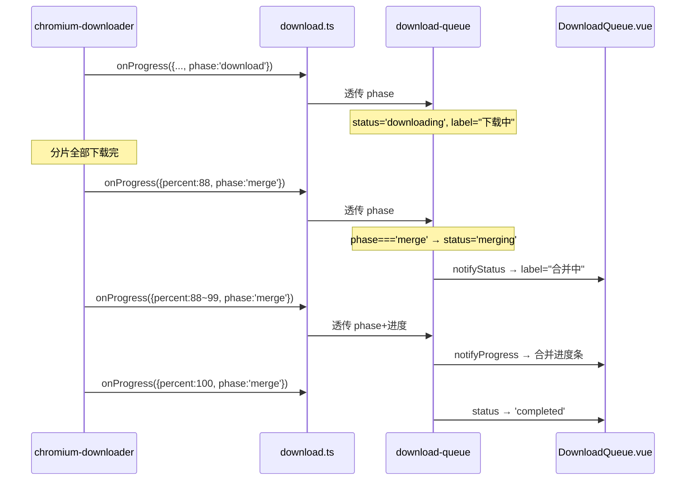

## 用户需求

1. 下载 TS 分片阶段：状态显示"下载中"
2. ffmpeg 合并 TS → MP4 阶段：状态显示"合并中"
3. 合并阶段降低 ffmpeg 进程优先级，避免抢占 CPU/磁盘 I/O 导致系统卡顿

## 核心功能

- 进度回调新增 `phase` 字段，标明当前阶段（`'download'` / `'merge'`）
- 队列项新增 `merging` 状态，检测到合并阶段时自动切换
- merging 状态可取消、不可暂停/移除/重试，进度条正常显示
- ffmpeg 合并进程和压缩进程 spawn 后立即降为 Below Normal 优先级（Windows）

## 视觉效果

- 合并阶段：状态标签从"下载中"切换为"合并中"，图标保持动态脉冲，进度条和百分比继续更新
- 合并完成后：切换为"已完成"（与现有逻辑一致）

## 技术栈

- 主进程：Electron + Node.js `child_process.spawn` + `os.setPriority`
- 渲染进程：Vue 3 Composition API + Pinia
- 无新增依赖

## 实现方案

### 核心策略

在 progress 回调数据中增加 `phase` 枚举字段，通过 chromium-downloader → download → download-queue 三文件透明透传。队列检测到 `phase='merge'` 时将 `item.status` 从 `'downloading'` 切换为 `'merging'`。ffmpeg spawn 后调用 `os.setPriority(pid, 10)` 降低进程优先级。

### 数据流

### 性能优化

- **ffmpeg 低优先级**：Windows `os.setPriority(pid, os.constants.priority.PRIORITY_BELOW_NORMAL)`（值为 10），让系统调度优先满足 Electron 渲染进程和其他应用
- **phase 字段**：通过已有 onProgress 通道传递，零额外 IPC 开销
- **status 切换**：仅在 phase 首次变为 'merge' 时触发一次 notifyStatus，不影响进度上报频率

### 防守逻辑表

| 操作 | downloading | merging | 说明 |
| --- | --- | --- | --- |
| 取消 | 允许 | 允许 | killAndRelease kill ffmpeg |
| 暂停 | 允许 | 禁止 | 合并阶段暂停无意义 |
| 移除 | 禁止 | 禁止 | 活跃任务不可移除 |
| 重试 | N/A | 禁止 | retryItem 仅接受 failed/cancelled |