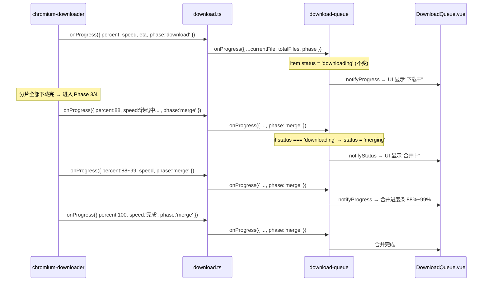

## 用户需求

下载流程中区分两个阶段的 UI 状态：

- TS 分片下载阶段：显示"下载中"
- ffmpeg 合并 TS 到 MP4 阶段：显示"合并中"

## 核心功能

- chromium-downloader.ts 的进度回调新增 `phase` 字段，标明当前是下载阶段还是合并阶段
- 进度回调链（chromium-downloader → download → download-queue）完整透传 phase
- download-queue.ts 新增 `merging` 状态，检测到 phase='merge' 时自动从 downloading 切换
- 前端 UI 新增 merging 状态的图标、标签、进度条、按钮守卫

## 技术方案

### 数据流

### 修改文件及具体位置

#### 1. chromium-downloader.ts — 进度回调增加 phase

- L38-42 `onProgress` 类型：`{ percent: number; speed: string; eta: string; phase?: 'download' | 'merge' }`
- L276-282 Phase 2 worker 进度：`phase: 'download'`
- L313 Phase 3 "转码中..."：`phase: 'merge'`
- L383-388 Phase 4 ffmpeg 进度：`phase: 'merge'`
- L399 Phase 4 完成：`phase: 'merge'`

#### 2. download.ts — 透传 phase

- L15-21 `DownloadOptions.onProgress` 类型增加 `phase?: string`
- L63-72 wrapper 中透传 `data.phase`

#### 3. download-queue.ts — 新增 merging 状态 + 守卫更新

- L21 `QueueItem.status`：`'pending' | 'downloading' | 'merging' | 'completed' | 'failed' | 'cancelled' | 'paused'`
- L420-426 `onProgress`：`if (data.phase === 'merge' && item.status === 'downloading') { item.status = 'merging' }`
- L125 `removeItem`：`if (item.status === 'downloading' || item.status === 'merging') { return false }`
- L140 `clearTerminal` filter 保留：`i.status === 'pending' || i.status === 'downloading' || i.status === 'paused' || i.status === 'merging'`
- L215 `cancelItem`：`if (item.status === 'downloading' || item.status === 'merging') { this.killAndRelease... }`
- L456-466 `.finally()` 中：merging 状态需要保持（不做特殊处理，Promise 返回后自然由 then/catch 接管）
- L435-446 `.then()` 中：guard 已检查 `item.status === 'downloading'`，merging 不会被覆盖

#### 4. progress.ts — 前端类型同步

- L13 `QueueItem.status`：加 `'merging'`

#### 5. DownloadQueue.vue — UI 更新

- L20-27 `STATUS_CONFIG` 新增：`merging: { icon: Download, class: 'text-accent-blue animate-pulse', bg: 'bg-accent-blue/10', label: '合并中' }`
- L144 进度条条件：`item.status === 'downloading' || item.status === 'paused' || item.status === 'merging'`
- L150 shimmer 动画：`item.status === 'downloading' || item.status === 'merging'`
- L156 百分比：`item.status === 'downloading' || item.status === 'merging'`
- L158 速度：`item.status === 'downloading' || item.status === 'merging'`（合并时 ffmpeg 也会上报 speed）
- L184 取消按钮：`item.status === 'downloading' || item.status === 'paused' || item.status === 'merging'`
- L200 移除按钮：`item.status !== 'downloading' && item.status !== 'merging'`
- L167 暂停按钮：保持 `item.status === 'downloading'`（合并不可暂停）

### 防守逻辑表

| 操作 | downloading | merging | 说明 |
| --- | --- | --- | --- |
| 取消 | 允许 | 允许 | killAndRelease kill ffmpeg |
| 暂停 | 允许 | 禁止 | 合并阶段暂停无意义 |
| 移除 | 禁止 | 禁止 | 活跃任务不可移除 |
| 重试 | N/A | 禁止 | retryItem 只接受 failed/cancelled |

### 性能考虑

- phase 字段通过已有 onProgress 回调传递，无额外 IPC 开销
- status 切换仅触发一次 notifyStatus，不影响进度上报频率
- 合并阶段 speed 来自 ffmpeg stderr parseProgressLine，无需额外计算