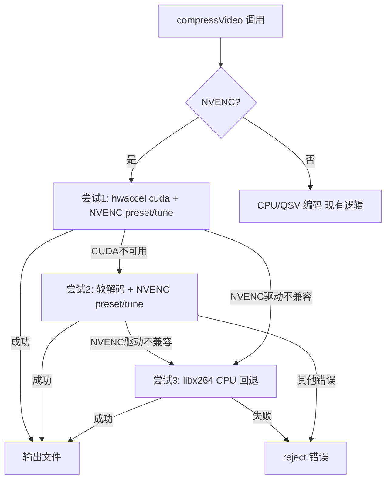

## 用户需求

审查 Compress 功能中使用 HEVC NVENC (`hevc_nvenc`) 编码时 GPU 占用率仅 50% 左右的问题，定位根因并优化至充分利用 GPU。

## 产品概述

当前视频压缩功能在使用 NVENC 硬件编码器时，GPU 利用率仅约 50%，远未达到硬件编码器的理论吞吐能力。经审查，根本原因是 ffmpeg 命令参数构建不完整：缺少 CUDA 硬件解码（`-hwaccel cuda`）、NVENC 编码预设/调优参数、以及前向参考帧分析。优化后预期 GPU 利用率提升至 80-95%，编码速度显著提升。

## 核心功能

- 为 NVENC 编码添加 CUDA 硬件解码加速（`-hwaccel cuda`），将输入解码从 CPU 卸载到 GPU
- 为 NVENC 编码添加专用 preset（p1-p7）、tune（hq）、rc-lookahead、spatial_aq 参数
- 扩展三级回退机制：CUDA 硬件解码 → 软解码+NVENC → libx264 CPU 编码
- 渲染端新增 NVENC 编码预设选择器（p1-p7），与现有 CPU preset 选择器互斥显示

## 技术栈

- 项目现有技术栈不变：Electron 31 + Vue 3.4 + TypeScript 5
- 核心修改集中在 `src/main/modules/ffmpeg-compress.ts`（ffmpeg 命令参数构建 + 回退逻辑）
- 渲染端修改：`CompressView.vue`（UI 选择器）、`stores/settings.ts`（持久化）、preload 类型声明

## 实现方案

### 1. 重构 `buildCompressArgs`（ffmpeg-compress.ts）

当前函数问题：`-i` 前无 `-hwaccel`，NVENC 时跳过 preset，缺少 tune/lookahead/spatial_aq。

**修改要点**：

- 函数签名增加 `useHwaccel: boolean` 参数
- 当 `useHwaccel && codec.includes('nvenc')` 时，在 `-i` 前插入 `-hwaccel cuda`
- NVENC 分支添加：`-preset <nvencPreset|p4> -tune hq -rc-lookahead 20 -spatial_aq 1`
- CPU 编码分支保持不变（`-preset fast` 等）
- QSV 分支保持不变
- 缩放滤镜保持 CPU `scale=`（兼容性优先，避免 scale_cuda 不可用风险；hwaccel cuda 已大幅减负）

**参数顺序**（NVENC + hwaccel）：

```
-hwaccel cuda -i input -c:v hevc_nvenc -rc vbr -cq 23 -vf scale=1280:720 -c:a aac -b:a 32k -preset p4 -tune hq -rc-lookahead 20 -spatial_aq 1 -movflags +faststart -y output
```

**参数顺序**（NVENC 无 hwaccel，回退场景）：

```
-i input -c:v hevc_nvenc -rc vbr -cq 23 -vf scale=1280:720 -c:a aac -b:a 32k -preset p4 -tune hq -rc-lookahead 20 -spatial_aq 1 -movflags +faststart -y output
```

### 2. 扩展 `compressVideo` 三级回退链（ffmpeg-compress.ts）

当前仅有一级回退（NVENC 驱动不兼容 → libx264）。需扩展为三级：

```
尝试1: -hwaccel cuda + NVENC preset/tune/lookahead/spatial_aq
  │ 失败(CUDA不支持/hwaccel错误)
  ▼
尝试2: 无hwaccel + NVENC preset/tune/lookahead/spatial_aq (软解码+GPU编码)
  │ 失败(NVENC驱动不兼容)
  ▼
尝试3: libx264 CPU编码 (现有回退逻辑)
```

**错误模式检测**：

- CUDA/hwaccel 不可用：`/hwaccel|cuda|cuInit|No capable devices|Unknown hwaccel/i`
- NVENC 驱动不兼容（现有）：`/Driver does not support|minimum required/i`

**回退通知**：CUDA→软解码回退不改变 codec，仅 `console.warn` 记录；NVENC→libx264 回退保持现有 `onFallback` 回调。

### 3. 类型与 IPC 穿透

- `CompressOptions` 接口添加 `nvencPreset?: string`
- `BatchCompressOptions` 的 files 数组类型添加 `nvencPreset?: string`
- preload `index.ts` / `index.d.ts` 中 `batchCompress` 参数类型同步更新
- `CompressView.vue` 的 `startCompress()` 中 `batchFiles` 映射添加 `nvencPreset` 字段

### 4. 渲染端 NVENC preset 选择器（CompressView.vue）

- 新增 `nvencPreset` ref，从 `settingsStore.compressPreset.nvencPreset` 初始化（默认 `'p4'`）
- 新增 `showNvencPreset` computed：`isGpuEncoder && codec.includes('nvenc')`
- 在 `showPreset`（CPU preset）下方新增 NVENC preset `<select>`，包含 p1-p7 选项
- 添加 InfoTooltip 说明 NVENC preset 含义（p1 极速 ~ p7 最佳质量）
- `savePreset()` 和 `savePresetDebounced()` 的 watch 列表添加 `nvencPreset`

### 5. 设置持久化（settings.ts）

- `compressPreset` 状态对象添加 `nvencPreset: string` 字段（默认 `'p4'`）
- `setCompressPreset` 方法参数和赋值添加 `nvencPreset`

## 实现注意事项

- **hwaccel 兼容性**：`ffmpeg-static` npm 包的 ffmpeg 二进制可能未编译 CUDA 支持。三级回退确保任何环境都能正常工作，CUDA 不可用时回退到软解码+NVENC（仍有 GPU 编码加速），再不行回退 CPU。
- **不使用 scale_cuda/scale_npp**：这些滤镜需要 ffmpeg 编译 CUDA/NPP 支持，兼容性差。CPU scale 开销远小于解码开销，hwaccel cuda 已将主要瓶颈（解码）卸载到 GPU。
- **不使用 `-hwaccel_output_format cuda`**：会导致帧留在 GPU 内存，与 CPU scale 滤镜不兼容。让 ffmpeg 自动处理 CPU↔GPU 内存传输。
- **进程优先级**：`runCompressPass` 中 `PRIORITY_BELOW_NORMAL` 保持不变，hwaccel 已将解码卸载到 GPU，不影响 GPU 调度。
- **错误检测正则**：CUDA 错误模式需覆盖 `cuInit failed`、`No capable devices found`、`Unknown hwaccel cuda` 等常见变体，避免误判。
- **NVENC preset 值**：p1-p7 是 NVENC 专用 preset，与 CPU preset（ultrafast-veryslow）完全不同，不能混用同一字段。
- **编码切换时 preset 清理**：用户从 NVENC 切回 CPU 时，`nvencPreset` 值保留但不影响 CPU 编码（`buildCompressArgs` 按 codec 分支取值）。

## 架构设计



## 目录结构

```
src/
├── main/modules/
│   └── ffmpeg-compress.ts          # [MODIFY] 核心修改：buildCompressArgs 重构 + compressVideo 三级回退 + CompressOptions/BatchCompressOptions 类型扩展
├── preload/
│   ├── index.ts                    # [MODIFY] batchCompress 参数类型添加 nvencPreset
│   └── index.d.ts                  # [MODIFY] ElectronAPI 接口同步更新
└── renderer/src/
    ├── stores/
    │   └── settings.ts             # [MODIFY] compressPreset 添加 nvencPreset 字段 + setCompressPreset 更新
    └── views/Compress/
        └── CompressView.vue        # [MODIFY] NVENC preset 选择器 UI + nvencPreset 状态管理 + startCompress 参数传递
```