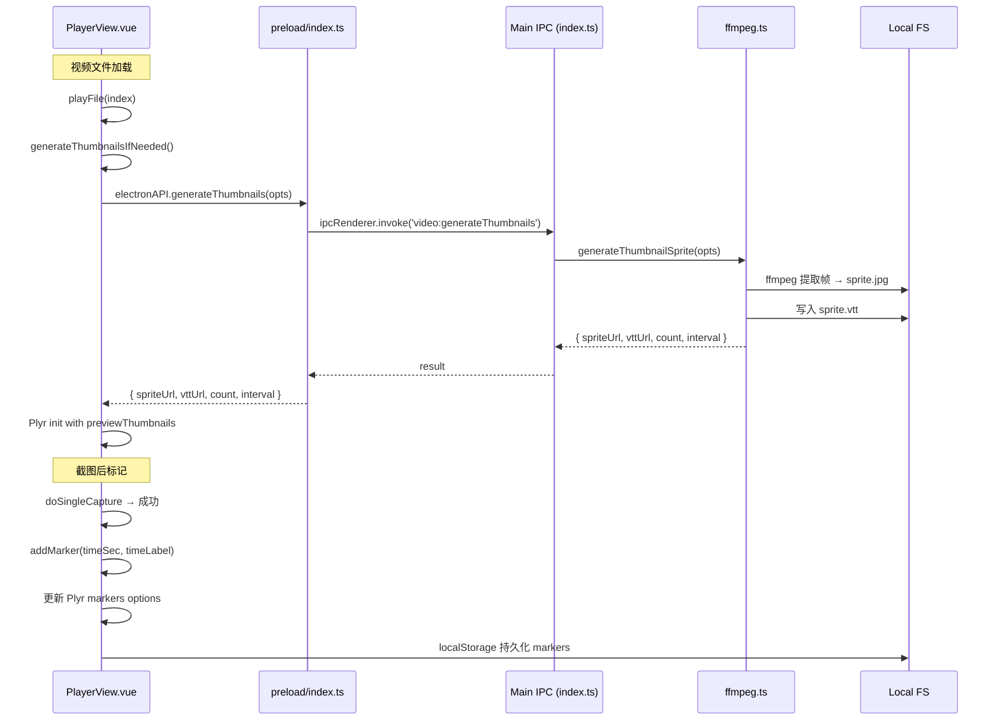

## 用户需求

为播放器增加三项 Plyr 原生支持的扩展功能：

1. **预览缩略图（Preview Thumbnails）**：鼠标悬停或拖拽进度条时，显示对应时间点的视频帧缩略图。使用 FFmpeg 批量提取帧合并为精灵图（sprite sheet），生成 VTT 元数据文件描述每个缩略图的位置和时间范围，传给 Plyr 的 `previewThumbnails` 选项。

2. **进度条标记点（Markers）**：每次截图（当前帧/指定时间/批量）成功后，在进度条对应位置生成可视标记点，点击可跳转到该时间点。使用 Plyr 的 `markers` 选项，标记点持久化到 localStorage。

3. **视频下方控制工具栏**：在视频播放器下方增加一行快捷按钮，包含三个控件：控件栏显示/隐藏切换按钮、播放速度快捷选择器（0.5x/0.75x/1x/1.25x/1.5x/2x）、自动隐藏控件开关。方便在 Plyr 控件栏自动隐藏后仍能快速操作。

## 技术栈

- 前端框架：Vue 3 + TypeScript + Composition API
- 播放器库：Plyr 3.8.4（已安装）
- 视频处理：FFmpeg（fluent-ffmpeg + ffmpeg-static，已安装）
- IPC 模式：Electron ipcMain.handle + wrapOperation 高阶函数
- 样式：SCSS Partial（_player.scss）+ CSS 变量

## 实现方案

### 1. 预览缩略图（Preview Thumbnails）

**策略**：FFmpeg 提取帧 → 拼接精灵图 → 生成 VTT 元数据 → Plyr `previewThumbnails` 选项

**主进程（ffmpeg.ts）新增 `generateThumbnailSprite` 函数**：

- 输入参数：视频路径 `input`、输出目录 `outputDir`、缩略图尺寸 `thumbWidth`/`thumbHeight`（默认 160x90）、间隔秒数 `interval`（默认每 5 秒一帧）
- 步骤 1：`ffmpeg -i input -vf "fps=1/<interval>,scale=<w>:<h>" -frames 1 outputDir/frame_%03d.jpg` 提取所有关键帧
- 步骤 2：使用 `ffmpeg -i outputDir/frame_%03d.jpg -filter_complex "tile=<cols>x<rows>" outputDir/sprite.jpg` 拼接精灵图（假设 10 列，超出自动换行）
- 步骤 3：生成 VTT 文件，每帧一行 `HH:MM:SS.mmm --> HH:MM:SS.mmm\nsprite.jpg#xywh=<x>,<y>,<w>,<h>`，定位精灵图中每帧的坐标
- 返回 `{ spriteUrl, vttUrl, count, interval }`，前端可用 `file://` 协议直接引用本地文件

**IPC 注册**：

- Channel: `video:generateThumbnails`，lockType: `thumbnail`，progressType: `thumbnail`
- 使用 `wrapOperation` 注册，支持进度推送和取消

**前端集成**：

- 视频切换时，异步生成缩略图（缓存：同一视频路径 + 相同参数不重复生成）
- 将 `previewThumbnails: { enabled: true, src: vttUrl }` 传入 Plyr 构造函数的 options

**性能考虑**：

- 典型 30 分钟视频，每 5 秒一帧 = 360 张，160x90 的 JPEG，单张约 3-5KB，精灵图约 1-2MB，生成耗时约 5-10 秒
- 异步非阻塞生成，不阻塞视频加载和播放
- 缓存机制：基于视频路径 + 修改时间的 hash 生成缓存 key，避免重复生成

---

### 2. 进度条标记点（Markers）

**策略**：截图后记录时间点 → 更新 Plyr `markers` 选项 → 持久化到 localStorage

**实现**：

- `PlayerView.vue` 新增 `screenshotMarkers: Ref<{ time: number; label: string }[]>` 状态
- 每次截图成功后，`captureCurrentFrame`/`captureByTime`/`batchCapture` 中在 `doSingleCapture` 成功回调里添加标记点
- 标记点去重：同一秒内已存在标记则跳过
- 将 `markers: { enabled: true, points: screenshotMarkers.value }` 传入 Plyr options
- 持久化：在 `settingsStore.playerData` 中新增 `screenshotMarkers` 字段，文件切换时恢复

**UI 效果**：Plyr 原生渲染圆点标记，悬停显示时间标签

---

### 3. 视频下方控制工具栏

**策略**：在 `<video>` 元素下方新增一行工具栏按钮，通过 Plyr API 控制播放器行为

**按钮设计**：

- **控件栏切换**：调用 `player.toggleControls(true)` 强制显示，再次点击调用 `player.toggleControls(false)` 恢复自动隐藏。用 `Eye`/`EyeOff` 图标切换状态
- **播放速度**：下拉选择器或横向速度按钮组，点击直接设置 `player.speed = x`，高亮当前速度
- **自动隐藏开关**：布尔状态控制 Plyr 选项 `hideControls`。动态修改需重建播放器，或改用 `player.on('controlsshown'/'controlshidden')` 事件 + 手动控制。更优方案：开关关闭时调用 `player.toggleControls(true)` 并阻止后续自动隐藏；开关打开时恢复默认行为

**布局**：工具栏位于 `.video-player-wrapper` 内部、`<video>` 下方，flex 横向排列，左边距与 Plyr 控件栏对齐

**状态持久化**：`showControlsBar`、`autoHideControls` 状态保存在 `settingsStore.playerData` 中

---

## 架构设计



## 目录结构

```
src/
├── main/
│   ├── index.ts                          # [MODIFY] 新增 video:generateThumbnails IPC handler（wrapOperation 模式）
│   └── modules/
│       └── ffmpeg.ts                     # [MODIFY] 新增 generateThumbnailSprite 函数（约 80 行）
├── preload/
│   ├── index.ts                          # [MODIFY] 新增 generateThumbnails API 桥接
│   └── index.d.ts                        # [MODIFY] 新增 generateThumbnails 类型声明
└── renderer/src/
    ├── views/Player/
    │   ├── PlayerView.vue                # [MODIFY] 核心改动：
    │   │                                  #   - 新增 screenshotMarkers ref + addMarker/removeMarker 函数
    │   │                                  #   - 新增 generateThumbnails 异步逻辑 + 缓存
    │   │                                  #   - Plyr 配置新增 previewThumbnails + markers 选项
    │   │                                  #   - 新增 showControlsOverlay/autoHideControls/speedOptions 状态
    │   │                                  #   - 模板新增视频下方工具栏（控件栏/速度/自动隐藏三个按钮）
    │   ├── _player.scss                  # [MODIFY] 新增 .player-toolbar 样式块
    │   └── types/
    │       └── index.ts                  # [MODIFY] PersistedPlayerData 新增 screenshotMarkers 字段
    └── config/
        └── features.ts                   # 无改动（播放器功能元数据不变）
```

## 关键代码结构

```typescript
// ---- ffmpeg.ts 新增 ----
export interface ThumbnailSpriteOptions {
  input: string
  outputDir: string
  thumbWidth?: number   // default 160
  thumbHeight?: number  // default 90
  interval?: number     // default 5 (seconds per thumbnail)
  onProgress?: ProgressCallback
}

export interface ThumbnailSpriteResult {
  spriteUrl: string    // file:///path/to/sprite.jpg
  vttUrl: string       // file:///path/to/sprite.vtt
  count: number        // total thumbnail count
  interval: number     // seconds between thumbnails
}

export function generateThumbnailSprite(opts: ThumbnailSpriteOptions): Promise<ThumbnailSpriteResult>

// ---- types/index.ts 新增 ----
export interface ScreenshotMarker {
  time: number    // seconds
  label: string   // e.g. "截图 #1"
}

// PersistedPlayerData 新增字段:
// screenshotMarkers: ScreenshotMarker[]

// ---- PlayerView.vue 新增状态 ----
const screenshotMarkers = ref<ScreenshotMarker[]>([])
const showControlsOverlay = ref(false)    // 控件栏强制显示
const autoHideControls = ref(true)        // 自动隐藏开关
const thumbnailGenerating = ref(false)    // 缩略图生成中
let thumbnailCacheKey = ''                // 缓存当前视频的缩略图路径
```

## 实现细节注意事项

- **性能**：缩略图生成使用 `ffmpeg -vf fps=1/N` 而非遍历 `-ss` 逐帧提取（后者 N 次 seek 极慢），一次性提取所有帧后拼接
- **缓存**：缩略图生成后写入视频同目录的隐藏文件夹（如 `.thumbnails/`），下次播放同视频时直接复用
- **日志**：缩略图生成失败不阻塞播放，静默回退到无预览模式，仅在控制台 warn
- **向后兼容**：PersistedPlayerData 新增字段设置默认空数组，旧数据迁移无影响
- **Plyr markers 限制**：markers 在播放器初始化时设置，后续更新需 destroy + recreate 播放器，因此改为在 `initAndPlay` 中传入最新 markers 列表
- **自动隐藏控件逻辑**：关闭自动隐藏时调用 `player.toggleControls(true)` + 监听 `controlshidden` 事件立即 `toggleControls(true)` 恢复；开启时取消监听恢复默认行为