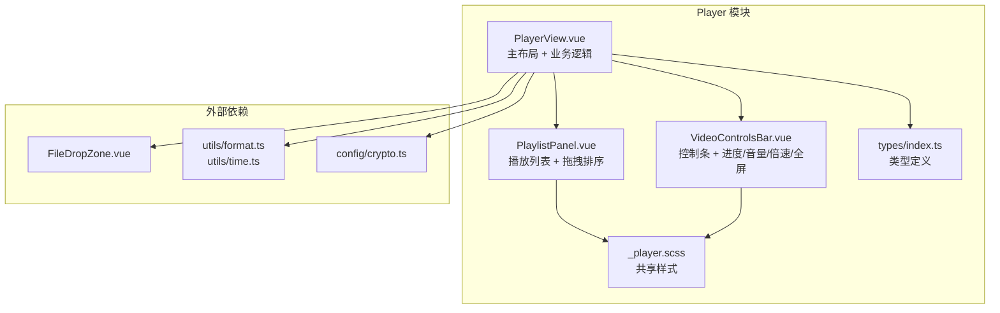

## 用户需求

在现有播放器功能基础上进行UI重构与功能扩展。

### UI优化

- **播放/暂停控制**：居中大按钮覆盖层，点击视频画面即可播放/暂停
- **进度条**：自定义进度条，支持鼠标拖拽跳转和缓冲区域预览（利用 video.buffered API）
- **音量控制**：音量滑块替代现有的 mute 切换按钮
- **全屏切换**：全屏按钮，使用 HTML5 Fullscreen API
- **响应式布局**：适配不同窗口尺寸

### 扩展功能

- **倍速播放**：0.5x / 0.75x / 1.0x / 1.25x / 1.5x / 2.0x 六档可切换
- **播放列表管理**：支持拖拽排序、添加文件、删除文件，保持与现有 FileDropZone 兼容

### 保持

- 现有深色科技风 UI 风格（玻璃态卡片、霓虹渐变、CSS 变量体系）
- 加密视频自动解密开关、密码弹窗、视频信息卡片
- 所有现有业务逻辑不变（文件管理、解密、元数据加载）

## 技术方案

### 组件拆分策略

将 782 行的单文件拆分为 3 个组件 + 1 个 SCSS + 1 个类型文件：

| 文件 | 职责 |
| --- | --- |
| `PlayerView.vue` | 主布局：header + 播放器区域 + 播放列表面板 + 视频信息卡片 + 密码弹窗 |
| `PlaylistPanel.vue` | 播放列表：文件展示、点击选择、删除、**HTML5 拖拽排序**、清空列表 |
| `VideoControlsBar.vue` | 播放控制条：进度条（缓冲预览+拖拽）、播放/暂停/上下曲、音量滑块、倍速选择、全屏、时间显示 |
| `types/index.ts` | 模块私有类型：PlayerEntry、PlaybackSpeed 等 |
| `_player.scss` | 播放器专属样式（进度条定制、缓冲预览、控件覆盖层动画等） |

### 新功能实现方式

| 功能 | 实现 | API |
| --- | --- | --- |
| 倍速播放 | 下拉菜单切换 | `video.playbackRate` |
| 音量滑块 | 横向 range input | `video.volume` (0~1) |
| 全屏 | 全屏/退出全屏按钮 | `video.requestFullscreen()` / `document.exitFullscreen()` |
| 进度条拖拽 | 自定义轨道，mousedown 监听 | `video.currentTime` |
| 缓冲预览 | 二次渲染缓冲区间高亮 | `video.buffered`（TimeRanges） |
| 列表拖拽排序 | HTML5 Drag & Drop | `dragstart` / `dragover` / `drop` 事件，splice 移动 |

### 架构设计

### 数据流

- **播放控制**：VideoControlsBar emit 事件（toggle-play / seek / volume-change / speed-change / toggle-fullscreen / prev / next）→ PlayerView 处理 → 操作 video DOM
- **播放列表**：PlaylistPanel 通过 v-model 双向绑定 files 数组，emit select / remove / reorder 事件 → PlayerView 更新 currentIndex
- **文件添加**：FileDropZone + 扫描文件夹按钮 → PlayerView.addFilesAndLoadMeta()
- **加密解密**：autoDecrypt toggle + 密码弹窗 → 调用 IPC decryptForPlayback → 获取 tempPath → 播放

### 进度条缓冲预览

- computed 计算 `bufferedPercent`：遍历 `video.buffered` TimeRanges，找到包含当前播放位置的最大缓冲区间
- 在进度条轨道上用第二个 div（背景色为 hsl(var(--border))）覆盖渲染缓冲区域宽度
- 拖拽时 mousedown 启动监听，mousemove 更新进度，mouseup 设置 `video.currentTime`

### 播放列表拖拽排序

- 每项添加 `draggable="true"`，`@dragstart` 存储源索引，`@dragover.prevent` 允许放置
- `@drop` 时从数组中 splice 移除源项，插入到目标位置
- 如果当前播放项被移动，同步更新 currentIndex

## 设计风格

延续现有深色科技风（Dark Tech）：玻璃态卡片 + 霓虹渐变主色系（accent-blue → accent-purple）+ 微动效。所有配色使用 CSS 变量，确保与浅色主题兼容。

## 页面布局

页面保持原始三区域布局（header + 左侧播放列表 + 右侧播放器），但做以下优化：

### Header 区域

- 标题"视频播放器"+ Play 图标在左侧
- 自动解密/手动解密切换开关在右侧，无变化

### 播放列表 Panel（左侧）

- FileDropZone 拖拽区 + 扫描文件夹按钮（无变化）
- 播放列表卡片：每项左侧序号/播放动画指示器 + 加密图标/视频图标 + 文件名 + 编码/分辨率信息 + 悬浮删除按钮
- **新增拖拽排序**：hover 时在项左侧出现拖拽手柄（GripVertical 图标），可上下拖动排序
- 拖拽时目标位置显示插入指示线

### 播放器区域（右侧）

- 视频画面：黑色背景，视频居中，保持宽高比
- **视频覆盖层**：点击暂停时显示居中半透明大播放按钮（52px 白色圆环），点击播放时隐藏；悬停视频时底部出现控制条
- **控制条**：半透明黑色背景条，从底部滑入（transition 0.2s），包含：

#### 进度条

- 全宽自定义轨道（h-1 hover 时扩展为 h-2），已播放部分为 accent-blue，缓冲部分为 border 色半透明，未播放部分为 bg-tertiary
- 悬浮拖拽手柄（圆点，accent-blue，hover 时放大）
- 左侧显示当前时间（MM:SS），右侧显示总时长（MM:SS）

#### 左侧控制组

- 上一曲（SkipBack，disabled 时置灰）
- 播放/暂停（圆形 accent-blue 按钮，图标白色）
- 下一曲（SkipForward）
- 音量按钮（Volume2/Volume1/VolumeX 动态切换）+ 悬浮时横向展开音量滑块（w-20）

#### 右侧控制组

- 倍速选择器：按钮显示当前倍速，点击弹出下拉菜单（0.5x/0.75x/1.0x/1.25x/1.5x/2.0x），当前选中项高亮
- 全屏按钮（Maximize/Minimize 切换）

### 视频信息卡片（底部，无变化）

保留现有 2x3 网格信息展示

### 密码弹窗（无变化）

保留 Teleport 到 body 的居中弹窗

## 交互反馈

- 所有按钮 hover 时 transition-colors 0.12s（符合项目 var(--transition-fast)）
- 控制条滑入/滑出 transition 0.2s
- 播放列表拖拽时源项半透明、目标位置蓝色指示线
- 缓冲区域平滑渲染（transition-width 0.3s）
- 倍速菜单展开/收起 transition-opacity + scale