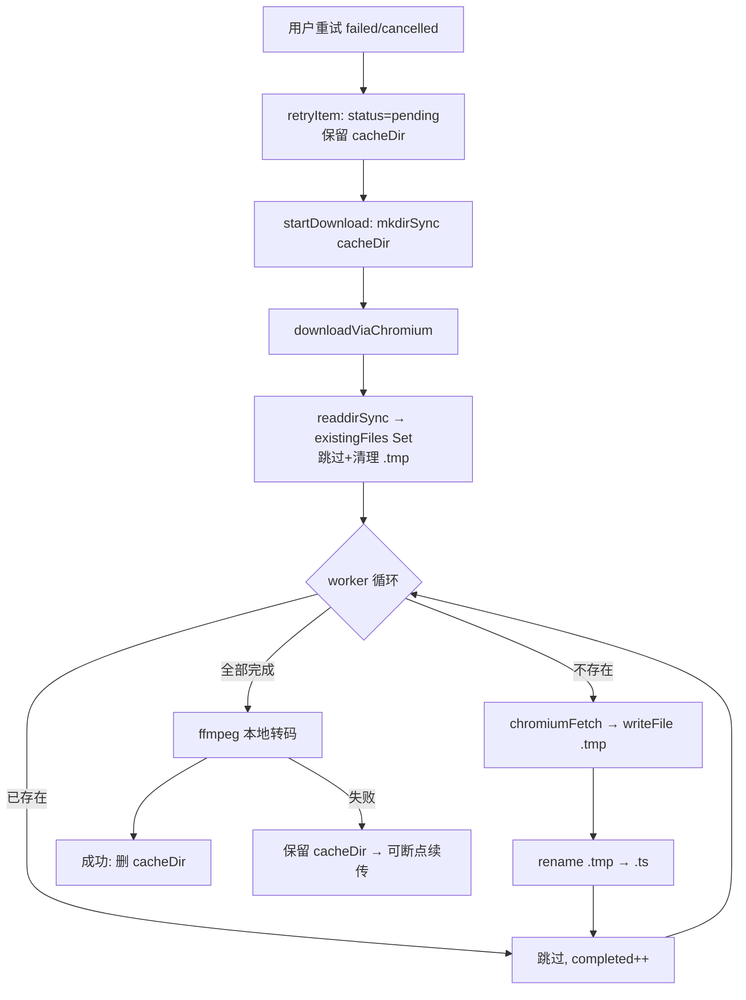

## 用户需求

修复下载功能的三个断点续传问题，使下载失败和取消后都能从断点恢复，而非从头开始：

1. **下载失败后可断点续传**：当前失败时删除全部已下载分片缓存，重试从头开始。改为保留缓存，重试时跳过已下载分片。
2. **已取消后可恢复下载**：当前 cancelled 状态无法重试，UI 无重试按钮。改为允许 cancelled 项重试并恢复。
3. **原子写入防止部分文件污染**：当前直接写目标文件，崩溃时留下截断文件被误判为已完成。改为先写临时文件再原子重命名。

## 核心功能

- 失败/取消后重试时，自动扫描已有分片文件并跳过，仅下载缺失部分
- 已取消的队列项显示"重试"按钮，点击后从断点恢复
- 分片写入采用 `.tmp` + `rename` 原子操作，崩溃后残留 `.tmp` 不影响 resume 判断
- 移除队列项时自动清理磁盘缓存目录，防止磁盘泄漏

## Tech Stack

- Electron 31 主进程：`net.fetch` + Node.js `fs.promises` / `child_process`
- TypeScript 严格模式
- Vue 3.4 `<script setup>` + Composition API（前端 UI）
- 现有 IPC 架构：`ipcMain.handle` ↔ `ipcRenderer.invoke`，无需新增通道

## Implementation Approach

### 根因与修复策略

| 问题 | 根因位置 | 修复策略 |
| --- | --- | --- |
| 失败从头开始 | `download-queue.ts:434-436` catch 块删 cacheDir + 清空引用 | 保留 cacheDir 和 `item.cacheDir` 引用 |
| 取消无法重试 | `download-queue.ts:144` retryItem 只接受 failed；`DownloadQueue.vue:186` 按钮只对 failed 显示 | retryItem 接受 cancelled；按钮条件加 cancelled |
| 部分文件污染 | `chromium-downloader.ts:209` 直接写目标文件 | 先写 `.tmp` 再 `rename`；resume 扫描跳过 `.tmp` |
| 磁盘泄漏 | `removeItem` / `clearTerminal` 不清理 cacheDir | 移除前 `rmSync(cacheDir)` |


### 数据流

```
用户点击重试(failed/cancelled)
  → retryItem: status='pending', 保留 cacheDir
  → scheduleTasks → startDownload
  → downloadM3u8(cacheDir=item.cacheDir)
  → downloadViaChromium:
      readdirSync(workDir) → existingFiles Set（跳过 .tmp）
      worker: existingFiles.has(seg.localPath)? 跳过 : 下载
      下载成功: writeFile(.tmp) → rename(.tmp → .ts)
```

### 关键决策

1. **失败时保留缓存 vs 删除**：保留。用户重试时可跳过已下载分片，节省时间和带宽。代价是磁盘占用，但 `removeItem` / `clearTerminal` 会清理。
2. **cancelled 项的 cacheDir 状态**：取消时 `killAndRelease` 设 status='cancelled'，catch 块的 `if (item.status === 'downloading')` guard 跳过删除逻辑，所以 cacheDir 本就保留。只需开放 retryItem + UI。
3. **原子写入用 `.tmp` + `rename`**：`fs.promises.rename` 在同分区是原子操作（Windows NTFS 同样保证）。resume 扫描跳过 `.tmp` 后缀文件，并在扫描时清理残留 `.tmp`。

## Implementation Notes

- **`retryItem` 需重置 `pausedAtPercent`**：cancelled 项可能从 paused → cancelled 转变而来，`pausedAtPercent` 有残留值。虽然 `startTime` 目前未转发到 `downloadViaChromium`（死代码），但重置可避免未来引入 bug。
- **`removeItem` / `clearTerminal` 清理 cacheDir**：completed 项的 cacheDir 已在 `.then` 中清理并设为 `undefined`，`rmSync` 对 undefined 路径会报错，需先判空。
- **原子 rename 的跨平台安全**：Windows 上 `rename` 目标已存在时会失败，需先 `unlink` 再 `rename`，或用 `fs.promises.rename` 配合 `force` 选项。实际上 Node.js `fs.promises.rename` 在 Windows 上会覆盖目标文件（POSIX 语义），无需额外处理。
- **resume 扫描清理 `.tmp`**：扫描时遇到 `.tmp` 文件直接 `unlink`，避免残留临时文件累积。
- **blast radius**：所有修改向后兼容。已有的 failed 项（`cacheDir=undefined`）重试时走全新下载路径，行为与修改前一致。

## Architecture Design

本次修改涉及 3 个文件，不改变现有架构，仅修补数据流中的缺陷：



## Directory Structure

共修改 3 个文件，无新增文件：

```
src/
├── main/modules/
│   ├── download-queue.ts       # [MODIFY] 4 处：catch 保留缓存、retryItem 接受 cancelled、removeItem/clearTerminal 清理缓存
│   └── chromium-downloader.ts  # [MODIFY] 2 处：原子写入 .tmp→rename、resume 扫描跳过+清理 .tmp
└── renderer/src/views/Download/
    └── DownloadQueue.vue       # [MODIFY] 1 处：重试按钮对 cancelled 状态也显示
```

### 各文件修改详情

**`download-queue.ts`** — 4 处修改：

1. **`.catch()` 块（~L428-438）**：删除 cacheDir 清理逻辑（`fs.rmSync` + `item.cacheDir = undefined`），仅保留 `item.status = 'failed'` 和 `item.error = cleanError(e)`。
2. **`retryItem()`（~L141-151）**：条件从 `!== 'failed'` 改为 `!== 'failed' && !== 'cancelled'`；新增 `item.pausedAtPercent = undefined` 重置。
3. **`removeItem()`（~L117-126）**：`splice` 前新增 cacheDir 清理：`if (item.cacheDir) { try { fs.rmSync(item.cacheDir, { recursive: true, force: true }) } catch {} }`。
4. **`clearTerminal()`（~L128-139）**：filter 前遍历被移除项，对每个有 cacheDir 的项执行 `rmSync`。

**`chromium-downloader.ts`** — 2 处修改：

1. **`downloadSegmentWithRetry` 内写入逻辑（~L208-210）**：

- `await fs.promises.writeFile(seg.localPath, resp.body)` → 先写 `seg.localPath + '.tmp'`，再 `await fs.promises.rename(tmpPath, seg.localPath)`。

2. **resume 扫描（~L225-231）**：

- 遍历 `readdirSync` 结果时，`.tmp` 后缀文件直接 `fs.unlinkSync` 清理，不加入 `existingFiles` Set。

**`DownloadQueue.vue`** — 1 处修改：

1. **重试按钮条件（~L186）**：`v-if="item.status === 'failed'"` → `v-if="item.status === 'failed' || item.status === 'cancelled'"`。