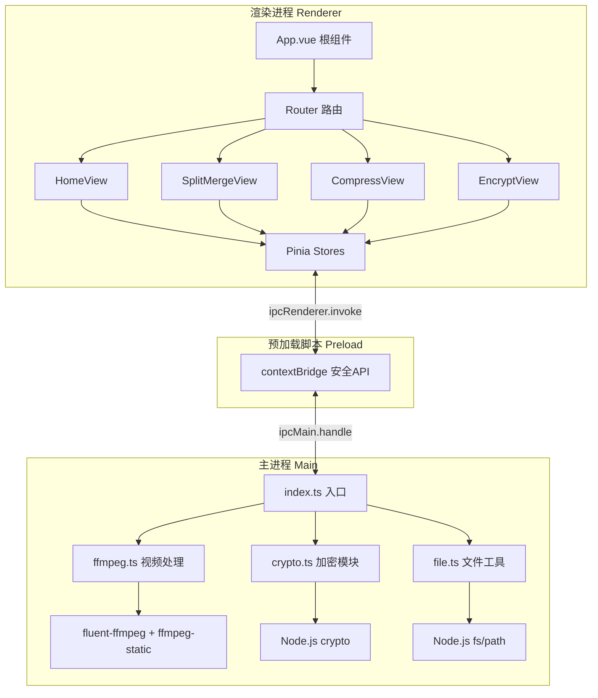

## 产品概览

一款模块化的桌面视频编辑工具，基于 electron-vite + Vue 3 + TypeScript 构建。界面采用深色科技风设计，左侧可折叠导航栏切换功能模块，右侧展示对应操作面板。支持 Windows/macOS/Linux 跨平台运行。

## 核心功能

1. 视频分割与合并（SplitMerge）

- 按起止时间点精确分割视频
- 将多个视频文件合并为一个
- 支持拖拽添加文件，列表管理文件顺序

2. 视频压缩（Compress）

- 多级压缩预设（高/中/低质量）与自定义参数
- 支持自定义码率、分辨率、编码格式
- 批量压缩，展示预估文件大小和实时进度

3. 视频加密与解密（Encrypt）

- AES-256-CTR 流式加密，密码保护
- 支持单文件和文件夹批量操作
- 加密文件生成专属扩展名标识

## 技术栈

| 层级 | 技术 | 说明 |
| --- | --- | --- |
| 桌面框架 | Electron 28+ | 跨平台桌面应用容器 |
| 构建工具 | electron-vite 3.x | 基于 Vite 的 Electron 专用构建工具 |
| 前端框架 | Vue 3.4+ Composition API | 渲染进程 UI 框架 |
| 类型系统 | TypeScript 5.x | 全栈类型支持 |
| 状态管理 | Pinia | Vue 3 官方状态管理 |
| 路由 | Vue Router 4 | SPA 页面路由 |
| UI 组件库 | Naive UI | 暗色主题桌面组件库 |
| 视频处理 | fluent-ffmpeg + ffmpeg-static | Node.js 端调用 FFmpeg |
| 加密 | Node.js crypto (AES-256-CTR) | 流式加密，大文件内存友好 |
| 打包分发 | electron-builder | 生成安装包 |


## 实现方案

### 整体策略

采用 electron-vite 官方推荐的**双进程分离架构**：

- **主进程**：负责 FFmpeg 视频处理、AES 加密、文件系统操作等 Node.js 能力
- **渲染进程**：负责 Vue UI 展示与用户交互
- **预加载脚本**：通过 `contextBridge` 建立安全的 IPC 通道连接两端

### 关键技术决策

1. **ffmpeg-static 而非依赖系统 FFmpeg**：打包时自动包含二进制，用户零依赖
2. **AES-256-CTR 流式加密**：通过 `fs.createReadStream` + `crypto.createCipheriv` + Transform Stream 管道处理大文件（>4GB），内存占用恒定
3. **Pinia 管理进度状态**：所有耗时操作（分割/压缩/加密）的进度通过 Pinia store 响应式驱动 UI 进度条
4. **模块按需加载**：主进程模块使用动态 import，减少冷启动时间

### 性能考量

- FFmpeg 通过 `child_process.spawn` 执行，解析 stderr 实时提取进度信息
- 压缩预估信息通过 ffprobe 获取原始视频元数据后前端计算，避免重复编码探测
- 渲染进程使用 Naive UI 的虚拟列表处理大量文件

### 项目代码风格

- 所有 `if` 语句必须带花括号 `{}`，即使只有一行
- 主进程模块使用 class 封装，统一接口导出
- 预加载脚本 API 类型声明在独立 `index.d.ts` 文件中

## 架构设计

### 系统架构图



### 数据流

1. 用户选择文件 + 配置参数（渲染进程）
2. 调用 `window.electronAPI.xxx(options)`（预加载脚本）
3. `ipcRenderer.invoke(channel, args)` 发送至主进程
4. 主进程 `ipcMain.handle` 接收，调用对应模块执行
5. 执行过程中通过 `event.sender.send('progress', data)` 推送进度
6. 预加载脚本监听进度事件，回调给渲染进程
7. 渲染进程更新 Pinia store，UI 响应式刷新

## 目录结构

```
snVideoEditor/
├── package.json                    # [NEW] 项目依赖和 npm scripts
├── electron.vite.config.ts         # [NEW] electron-vite 三合一配置
├── tsconfig.json                   # [NEW] 根 TypeScript 配置
├── tsconfig.node.json              # [NEW] 主进程 TS 配置
├── tsconfig.web.json               # [NEW] 渲染进程 TS 配置
├── electron-builder.yml            # [NEW] electron-builder 打包配置
├── .gitignore                      # [NEW] Git 忽略规则
├── resources/                      # [NEW] 打包资源（ffmpeg 二进制占位）
├── build/
│   └── icon.png                    # [NEW] 应用图标
├── src/
│   ├── main/                       # 主进程
│   │   ├── index.ts                # [NEW] 入口：创建窗口 + 注册 IPC
│   │   └── modules/
│   │       ├── ffmpeg.ts           # [NEW] FFmpeg 封装：分割/合并/压缩 + 进度回调
│   │       ├── crypto.ts           # [NEW] AES-256-CTR 流式加解密
│   │       └── file.ts             # [NEW] 文件工具：选择对话框/元信息/批量遍历
│   ├── preload/                    # 预加载脚本
│   │   ├── index.ts                # [NEW] contextBridge 暴露安全 API
│   │   └── index.d.ts             # [NEW] window.electronAPI 类型声明
│   └── renderer/                   # Vue 渲染进程
│       ├── index.html              # [NEW] 入口 HTML
│       └── src/
│           ├── main.ts             # [NEW] Vue 应用入口：挂载 Pinia + Router
│           ├── App.vue             # [NEW] 根组件：SideNav + RouterView
│           ├── router/
│           │   └── index.ts        # [NEW] 路由：Home/SplitMerge/Compress/Encrypt
│           ├── stores/
│           │   ├── progress.ts     # [NEW] 进度状态（所有模块共用）
│           │   └── settings.ts     # [NEW] 用户偏好（输出目录/压缩预设）
│           ├── views/
│           │   ├── HomeView.vue    # [NEW] 首页：功能卡片导航
│           │   ├── SplitMergeView.vue  # [NEW] 分割合并操作页
│           │   ├── CompressView.vue    # [NEW] 视频压缩操作页
│           │   └── EncryptView.vue     # [NEW] 加密解密操作页
│           ├── components/
│           │   ├── SideNav.vue         # [NEW] 左侧导航栏组件
│           │   ├── FileDropZone.vue    # [NEW] 文件拖拽区域组件
│           │   ├── ProgressPanel.vue   # [NEW] 进度面板（进度条+日志）
│           │   └── VideoPreview.vue    # [NEW] 视频预览组件
│           └── assets/
│               └── styles/
│                   └── global.scss     # [NEW] 全局样式 + 暗色主题变量
```

## 关键代码结构

### 预加载 API 类型声明 (`src/preload/index.d.ts`)

```typescript
export interface ElectronAPI {
  // 文件操作
  selectVideoFiles: () => Promise<string[]>;
  selectDirectory: () => Promise<string | null>;
  getFileInfo: (filePath: string) => Promise<{ size: number; ext: string }>;

  // 分割合并
  splitVideo: (opts: { input: string; output: string; start: string; duration: string }) => Promise<boolean>;
  mergeVideos: (opts: { inputs: string[]; output: string }) => Promise<boolean>;

  // 压缩
  compressVideo: (opts: { input: string; output: string; crf: number; resolution: string }) => Promise<boolean>;
  getVideoMeta: (filePath: string) => Promise<{ duration: number; width: number; height: number; bitrate: number; codec: string }>;

  // 加密解密
  encryptVideo: (opts: { input: string; output: string; password: string }) => Promise<boolean>;
  decryptVideo: (opts: { input: string; output: string; password: string }) => Promise<boolean>;

  // 进度
  onProgress: (cb: (info: ProgressInfo) => void) => void;
  removeProgressListener: () => void;
  cancelOperation: () => void;
}

declare global {
  interface Window {
    electronAPI: ElectronAPI;
  }
}
```

### 进度信息模型

```typescript
interface ProgressInfo {
  type: 'split' | 'merge' | 'compress' | 'encrypt' | 'decrypt';
  percent: number;       // 0-100
  currentFile: number;
  totalFiles: number;
  speed: string;
  eta: string;
}
```

## 设计风格

采用**深色科技风 (Dark Tech)** 设计语言，深灰蓝背景搭配霓虹蓝紫渐变点缀，营造专业视频编辑工具的沉浸式工作环境。布局为经典两栏结构：左侧可折叠导航栏，右侧为功能操作区。

## 页面规划（4个页面）

### 首页 HomeView

- **顶部 Banner 区**：应用 Logo + 大标题「SN Video Editor」，渐变光晕背景
- **功能卡片区**：3 张大卡片（分割合并/视频压缩/加密解密），含图标、标题、功能描述和「开始使用」按钮。悬停触发上浮 + 发光边框动效
- **底部快速状态栏**：显示 FFmpeg 就绪状态 + 最近处理任务记录

### 分割合并页 SplitMergeView

- **左侧面板**：文件拖拽区域 + 已添加文件列表，支持单选/多选和排序拖拽
- **右侧参数面板**：模式切换（分割/合并），分割模式含起止时间输入框，合并模式可拖拽调整文件顺序
- **底部操作栏**：输出目录选择 + 文件名预览 +「开始处理」按钮 + 进度面板

### 视频压缩页 CompressView

- **左侧文件列表**：批量拖拽添加，表格展示文件名、原始大小、时长
- **右侧参数面板**：压缩预设快捷选择（高/中/低 + 自定义）、分辨率下拉、码率滑块、编码格式选择
- **底部区**：预估压缩后大小卡片 + 「开始压缩」按钮 + 进度面板

### 加密解密页 EncryptView

- **顶部模式切换**：加密 / 解密 Tab 选项卡切换
- **左侧文件区**：单文件或文件夹选择，展示待处理文件列表
- **右侧参数区**：密码输入框（含强度指示条）+ 输出目录选择
- **底部操作栏**：「开始加密」/「开始解密」按钮 + 进度面板

## 交互与动效

- 页面切换：fade + slide 组合过渡
- 卡片悬停：scale(1.02) + box-shadow 扩散光晕
- 进度条：渐变色填充 + 脉冲动画
- 文件拖拽区：drag over 时边框发光 + 虚线变色提示
- 操作结果通知：右上角滑入 Toast（成功绿/失败红）

## 使用的 Agent Extensions

### Skill

- **universal-arch-skill**
- 用途：在实现过程中对项目进行架构校验，确保模块化结构、注册完整性、样式分离符合规范
- 预期成果：生成架构审查报告，确保所有功能模块遵循 electron-vite 约定和本项目分层规范

- **vue-router-best-practices**
- 用途：指导 Vue Router 4 的路由配置、导航守卫和组件级路由最佳实践
- 预期成果：生成规范的路由配置文件，正确处理页面过渡与模块间导航