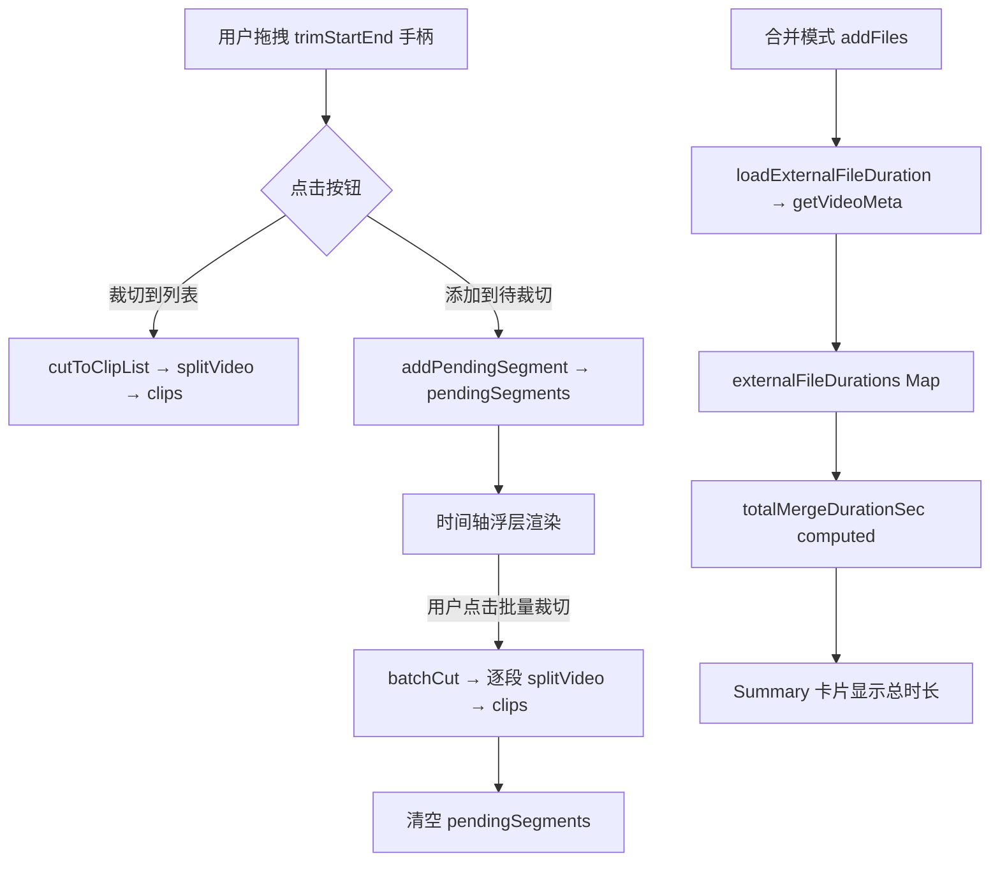

## 产品概述

为 SplitMerge 模块新增批量裁切和片段时长实时预览两项高价值功能，提升视频编辑效率。

## 核心功能

### 批量裁切

- 在现有单区段选择手柄（trimStartSec/trimEndSec）基础上，新增"添加到待裁切"按钮，将当前区段保存到待裁切列表
- 待裁切区段做重叠检测，与已有区段或现有 clips 区间重叠时拒绝添加并提示
- 时间轴上以琥珀色半透明浮层（`absolute` 定位，`z-index:3`）渲染所有待裁切区段，低于 playhead（`z-index:5`）
- 每个待裁切区段可单独移除（浮层 hover 时显示 X 关闭按钮）
- "一键批量裁切"按钮遍历 pendingSegments 调用现有 `splitVideo` IPC，逐段裁切后全部添加到 clips 列表
- 批量处理期间按钮禁用并显示进度（"裁切中 N/M..."）

### 片段时长实时预览

- 合并模式下添加外部文件时自动异步加载视频时长元数据（调用现有 `getVideoMeta` IPC）
- 使用 `externalFileDurations: Map<string, number>` 缓存已加载时长，避免重复请求
- 新增 `totalMergeDurationSec` computed：sum(clips 中已选中片段的 duration) + sum(已知外部文件时长)
- 合并 Summary 卡片新增一行显示"预计输出时长：HH:MM:SS"
- 未加载完毕的外部文件显示 `--:--:--`，加载完毕自动更新

## 技术栈

- 前端：Vue 3.4 + TypeScript 5 + Composition API（`<script setup lang="ts">`）
- IPC：复用现有 `getVideoMeta`、`splitVideo`，无需主进程改动
- 样式：SCSS scoped（inline `<style scoped>`），遵循项目设计 Token 体系

## 实现方案

### 批量裁切

**策略**：保留现有单区段 UI 不变，在其下层叠加待裁切区段列表。用户通过"添加"按钮将当前区段"快照"到 `pendingSegments` 数组，时间轴以 `absolute` 浮层渲染。

**数据结构**：

```ts
// types/file.ts 新增
interface SegmentRange {
  id: string        // 唯一标识（`seg_${Date.now()}_${counter}`）
  startSec: number
  endSec: number
}
```

**关键逻辑**：

- `addPendingSegment()`：先校验 `clipDurationSec > 0`，再与 `pendingSegments` 和 `clips` 做重叠检测（`Math.max(start1, start2) < Math.min(end1, end2)`），通过则 push
- `removePendingSegment(id)`：从数组中 filter 移除
- `batchCut()`：遍历 `pendingSegments`，逐一 `await splitVideo`，成功后 push 到 `clips`，显示进度文字；全部完成后清空 `pendingSegments`
- 切换视频文件时自动清空 `pendingSegments`

**时间轴渲染**：使用 `absolute` 定位，不需要修改现有 flex 三段式布局。每个待裁切区段生成：

```html
<div class="pending-segment" :style="{ left: s% + '%', width: w% + '%' }">
  <button @click="removePendingSegment(...)" class="seg-remove-btn">X</button>
</div>
```

`z-index: 3`（低于 playhead 的 `z-index:5`），背景用琥珀色半透明渐变区分于当前选中区域（蓝紫色）。

**性能**：`pendingSegments` 通常不超过 20 个，遍历 O(n) 足够。`batchCut` 逐段串行处理避免 ffmpeg 并发争抢资源。

### 片段时长实时预览

**策略**：在 `addFiles` 中为每个新添加的外部文件异步调用 `getVideoMeta`，将 `duration` 存入 `externalFileDurations: Map<string, number>`。合并模式 Summary 卡片新增 total duration 行。

**关键逻辑**：

- `addFiles` 中：对每个新文件 `void loadExternalFileDuration(f)`（不阻塞 addFiles 返回）
- `loadExternalFileDuration(path)`：try-catch 包裹 `getVideoMeta`，成功则 `externalFileDurations.value.set(path, meta.duration)`；失败则 console.warn，不阻断流程
- `removeFile` 中：`externalFileDurations.value.delete(path)`
- `totalMergeDurationSec` computed：遍历 selectedClips 求和 `duration` + 遍历 `files` 从 Map 取时长（无则计 0）
- `totalMergeDurationStr` computed：`secondsToHMS(totalMergeDurationSec.value)`

**性能**：`getVideoMeta` 为异步 IPC（ffprobe），不阻塞 UI。多个文件并发请求，Map 缓存避免重复加载。

## 目录结构

```
src/renderer/src/
├── types/
│   └── file.ts                        # [MODIFY] 新增 SegmentRange 接口
└── views/SplitMerge/
    └── SplitMergeView.vue             # [MODIFY] 批量裁切 + 时长预览全部逻辑
```

## 架构设计

### 数据流



### 时间轴 z-index 层级

```
z-index: 5  → timeline-playhead（播放头指示线）
z-index: 3  → pending-segment（待裁切区段浮层）
z-index: 2  → trim-handle（当前选区手柄）
z-index: 1  → timeline-selected（当前选区底色）
```

## 关键代码结构

```ts
// types/file.ts — 新增
export interface SegmentRange {
  id: string
  startSec: number
  endSec: number
}

// SplitMergeView.vue — 新增状态
const pendingSegments = ref<SegmentRange[]>([])
let segmentIdCounter = 0
const externalFileDurations = ref<Map<string, number>>(new Map())

// 新增 computed
const totalMergeDurationSec = computed(() => {...})
const totalMergeDurationStr = computed(() => secondsToHMS(totalMergeDurationSec.value))

// 新增函数
function addPendingSegment(): void
function removePendingSegment(id: string): void
function hasSegmentOverlap(s1: SegmentRange, s2: SegmentRange): boolean
async function batchCut(): Promise<void>
async function loadExternalFileDuration(path: string): Promise<void>
```