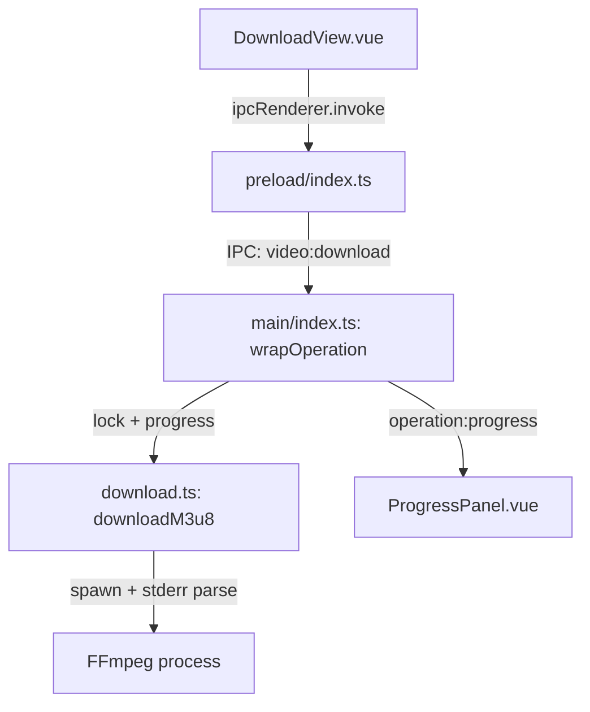

## 用户需求

新增"视频下载"功能模块，支持通过 m3u8 URL 下载在线流媒体视频并自动合并为 MP4 文件。

## 产品概述

在 SN Video Editor 中新增一个完整的视频下载工具页面，用户粘贴 m3u8 播放地址后即可一键下载，支持自定义 HTTP 请求头以访问受 Referer/Origin 保护的流媒体资源。

## 核心功能

- **m3u8 URL 下载**：输入 m3u8 地址，FFmpeg 自动拉取所有 ts 分片并合并为单个 MP4
- **自定义 HTTP 请求头**：可配置 Referer、User-Agent、Origin、Cookie 等头信息，支持多行 key-value 编辑，附带常用 User-Agent 预设
- **输出设置**：选择保存目录和文件名，支持桌面/下载/自定义三种快速选择
- **实时下载进度**：复用已有的进度面板组件，显示进度百分比和速度
- **取消下载**：支持随时取消当前下载任务，复用已有的取消机制

## 技术栈

- 主进程：Node.js + TypeScript，spawn 调用 FFmpeg，复用 `src/main/modules/ffmpeg.ts` 中的 `parseProgressLine`/`timeToSeconds`/`cancelFfmpegOperation`/`getFfmpegPath`
- IPC 通信：`wrapOperation` 统一注册模式（锁管理 + 进度转发 + 自动释放）
- 渲染进程：Vue 3.4 + Composition API + TypeScript + TailwindCSS
- 无新增第三方依赖，仅使用已有的 ffmpeg-static

## 实现方案

### 整体策略

新建独立的 `src/main/modules/download.ts` 模块封装下载逻辑，使用 FFmpeg 的 HLS 协议能力直接下载 m3u8 流。核心命令：

```
ffmpeg -headers "Referer: xxx\r\nUser-Agent: xxx" -i "url.m3u8" -c copy -bsf:a aac_adtstoasc -y output.mp4
```

- `-c copy` 无损复制流，避免重新编码导致速度下降
- `-bsf:a aac_adtstoasc` 将 AAC ADTS 头转为 MP4 兼容格式
- 复用 `parseProgressLine` 从 stderr 中提取 `Duration:` 和 `time=` 计算进度

### 架构设计



### 关键决策

1. **不引入额外依赖**：直接用 `child_process.spawn` 调用 FFmpeg，无需 axios/node-fetch 等 HTTP 库
2. **复用已有基础设施**：`parseProgressLine`、`timeToSeconds`、`cancelFfmpegOperation`、`wrapOperation` 全部直接复用
3. **headers 格式**：FFmpeg 的 `-headers` 参数采用 `Key: Value\r\n` 格式，UI 层以 key-value 对的形式编辑，在 download.ts 中拼接
4. **进度计算**：从 FFmpeg stderr 提取 `Duration: HH:MM:SS.mm` 作为总时长，`time=HH:MM:SS.mm` 作为当前进度

### 实现细节

- **下载模块** (`download.ts`)：导出 `downloadM3u8()` 函数，遵循现有模块的函数签名模式（接收 opts + onProgress，返回 Promise<boolean>），通过设置 `currentProc` 支持取消
- **IPC 注册**：使用 `wrapOperation<'download'>(...)` 注册，lockType 和 progressType 均为 `'download'`
- **类型扩展**：`ProgressInfo.type` 联合类型新增 `'download'`
- **取消机制**：直接复用 `cancelFfmpegOperation()`，不需额外代码

## 设计风格

延续项目深色科技风（Dark Tech），采用与压缩页面相似的布局：左侧输入区、右侧参数配置区。卡片使用玻璃态面板 + 霓虹光晕效果。

## 页面布局（DownloadView.vue）

采用左右双栏布局（lg:grid-cols-2）：

### 左侧：URL 输入与请求头配置

- **URL 输入区**：glass-card 包裹，大号输入框，placeholder 提示"请输入 m3u8 播放地址"，底部显示输入提示文字
- **请求头配置区**：默认展开 Referer 和 User-Agent 两行，可点击"添加请求头"增加行（Origin、Cookie 等），每行包含 key 输入框 + value 输入框 + 删除按钮，底部提供常用 UA 快捷填充按钮

### 右侧：输出设置与操作

- **输出设置卡片**：快速选择按钮（桌面/下载/自定义），显示当前输出目录路径，文件名输入框（默认从 URL 提取）
- **下载按钮**：渐变色大按钮（from-accent-blue to-accent-purple），显示"开始下载"，禁用态变灰
- **进度面板**：复用 ProgressPanel 组件
- **错误提示**：红色 alert 区域

### 交互细节

- 请求头行支持动态增删，最少保留 Referer 和 User-Agent 两行
- 文件名默认从 URL 末尾提取，自动追加时间戳后缀
- 下载中按钮变为"下载中..."，ProgressPanel 显示实时进度

## Agent Extensions

### SubAgent

- **code-explorer**
- 用途：探索项目现有代码模式，确认 ffmpeg.ts 中 `parseProgressLine`、`timeToSeconds`、`cancelFfmpegOperation`、`currentProc` 的具体实现，以及 `wrapOperation` 的精确用法
- 预期结果：确认所有可复用的 API 签名和导出方式，确保 download.ts 的实现与现有模块风格完全一致